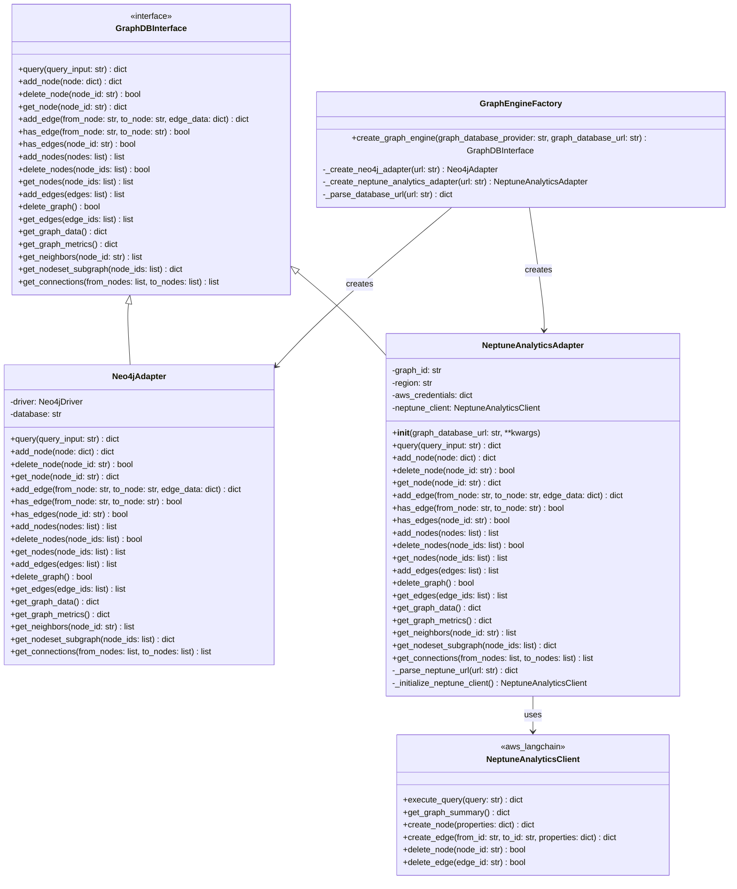

# Neptune Analytics Class Diagram

## SUMMARY

This diagram shows the Neptune Analytics adapter class diagram. 

Benefits:
• Maintains consistency with existing Cognee patterns
• Follows the same interface contract as other graph database adapters
• Seamless integration with the factory pattern
• Proper separation of concerns with external library dependencies

The diagram shows how all components work together while maintaining the modular architecture that Cognee already uses for its graph database abstraction layer.

## ELEMENTS
• NeptuneAnalyticsAdapter extends GraphDBInterface just like the existing Neo4jAdapter
• URL format handling for neptune-graph://<GRAPH_ID>
• Integration with aws_langchain library through NeptuneAnalyticsClient
• Updated GraphEngineFactory to support the new provider
• Comprehensive test suite similar to the existing Neo4j tests

## PRESENTATION

## Key Components

### NeptuneAnalyticsAdapter
- **Location**: `cognee/infrastructure/databases/graph/neptune_analytics_driver/adapter.py`
- **Purpose**: Main adapter class implementing GraphDBInterface for Neptune Analytics
- **Key Features**:
  - Parses `neptune-graph://<GRAPH_ID>` URL format
  - Uses aws_langchain library for Neptune Analytics operations
  - Implements all required CRUD and bulk operations
  - Handles AWS credentials and region configuration

### GraphEngineFactory Updates
- **Location**: `cognee/infrastructure/databases/graph/get_graph_engine.py`
- **Changes**: 
  - Add Neptune Analytics provider support
  - Handle neptune-graph:// URL parsing
  - Instantiate NeptuneAnalyticsAdapter when selected

### Test Suite
- **Location**: `cognee/tests/test_neptune_analytics.py`
- **Purpose**: Comprehensive testing similar to existing Neo4j tests
- **Features**:
  - Unit tests with mocks
  - Integration tests for real Neptune instances
  - URL parsing validation
  - Error handling verification

### Dependencies
- **aws_langchain**: Primary library for Neptune Analytics integration
- **boto3**: AWS SDK for authentication and region handling
- **pytest**: Testing framework consistency with existing tests
