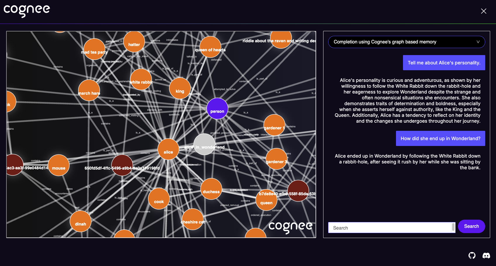
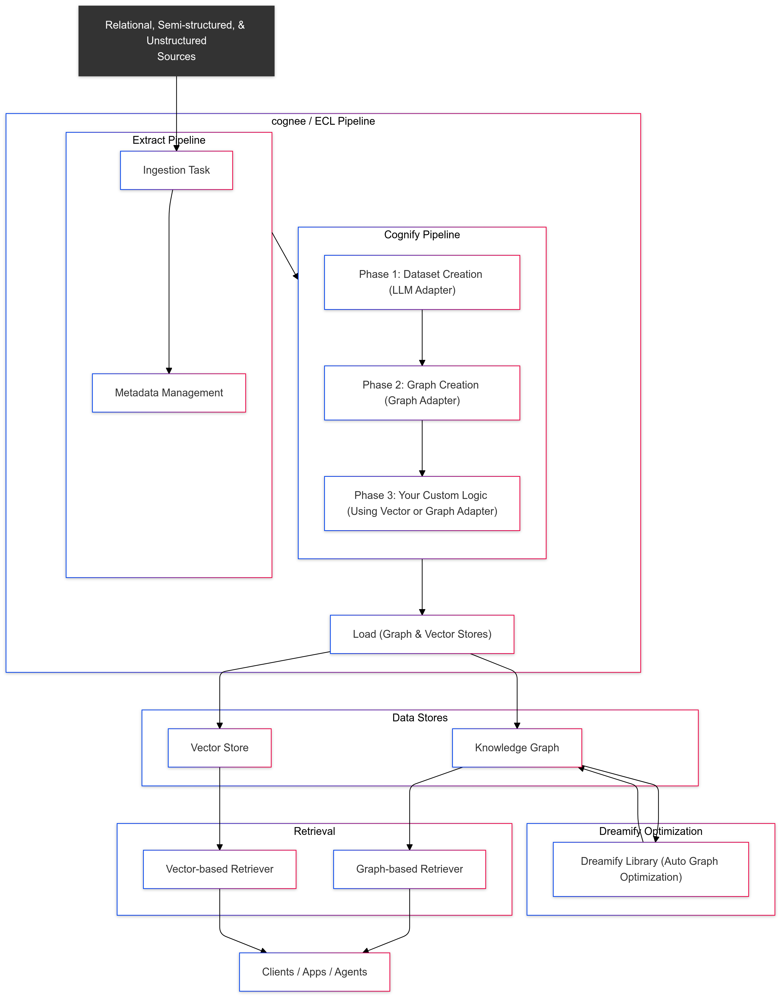

<div align="center">
  <a href="https://github.com/topoteretes/cognee">
    
  </a>

  <br />

  cognee - Memory for AI Agents in 5 lines of code

  <p align="center">
  <a href="https://www.youtube.com/watch?v=1bezuvLwJmw&t=2s">Demo</a>
  .
  <a href="https://cognee.ai">Learn more</a>
  ·
  <a href="https://discord.gg/NQPKmU5CCg">Join Discord</a>
  </p>


  [](https://GitHub.com/topoteretes/cognee/network/)
  [](https://GitHub.com/topoteretes/cognee/stargazers/)
  [](https://GitHub.com/topoteretes/cognee/commit/)
  [](https://github.com/topoteretes/cognee/tags/)
  [](https://pepy.tech/project/cognee)
  [](https://github.com/topoteretes/cognee/blob/main/LICENSE)
  [](https://github.com/topoteretes/cognee/graphs/contributors)

<a href="https://www.producthunt.com/posts/cognee?embed=true&utm_source=badge-top-post-badge&utm_medium=badge&utm_souce=badge-cognee" target="_blank"></a>


Build dynamic Agent memory using scalable, modular ECL (Extract, Cognify, Load) pipelines.

More on [use-cases](https://docs.cognee.ai/use-cases) and [evals](https://github.com/topoteretes/cognee/tree/main/evals) 

  <p align="center">
  🌐 Available Languages
  :
  <a href="community/README.pt.md">🇵🇹 Português</a>
  ·
  <a href="community/README.zh.md">🇨🇳 [中文]</a>
  </p>

<div style="text-align: center">
  
</div>

</div>


## Features

- Interconnect and retrieve your past conversations, documents, images and audio transcriptions
- Reduce hallucinations, developer effort, and cost.
- Load data to graph and vector databases using only Pydantic
- Manipulate your data while ingesting from 30+ data sources

## Get Started

Get started quickly with a Google Colab  <a href="https://colab.research.google.com/drive/1jHbWVypDgCLwjE71GSXhRL3YxYhCZzG1?usp=sharing">notebook</a>  or  <a href="https://github.com/topoteretes/cognee-starter">starter repo</a>

## Contributing
Your contributions are at the core of making this a true open source project. Any contributions you make are **greatly appreciated**. See [`CONTRIBUTING.md`](CONTRIBUTING.md) for more information.


## 📦 Installation

You can install Cognee using either **pip**, **poetry**, **uv** or any other python package manager.

### With pip

```bash
pip install cognee
```

## 💻 Basic Usage

### Setup

```
import os
os.environ["LLM_API_KEY"] = "YOUR OPENAI_API_KEY"

```

You can also set the variables by creating .env file, using our <a href="https://github.com/topoteretes/cognee/blob/main/.env.template">template.</a>
To use different LLM providers, for more info check out our <a href="https://docs.cognee.ai">documentation</a>


### Simple example

This script will run the default pipeline:

```python
import cognee
import asyncio


async def main():
    # Add text to cognee
    await cognee.add("Natural language processing (NLP) is an interdisciplinary subfield of computer science and information retrieval.")

    # Generate the knowledge graph
    await cognee.cognify()

    # Query the knowledge graph
    results = await cognee.search("Tell me about NLP")

    # Display the results
    for result in results:
        print(result)


if __name__ == '__main__':
    asyncio.run(main())

```
Example output:
```
  Natural Language Processing (NLP) is a cross-disciplinary and interdisciplinary field that involves computer science and information retrieval. It focuses on the interaction between computers and human language, enabling machines to understand and process natural language.
  
```

### cognee UI

You can also cognify your files and query using cognee UI. 

</a>

Try cognee UI out locally [here](https://docs.cognee.ai/how-to-guides/cognee-ui).

## Understand our architecture

<div style="text-align: center">
  
</div>


## Demos

1. What is AI memory:

[Learn about cognee](https://github.com/user-attachments/assets/8b2a0050-5ec4-424c-b417-8269971503f0)

2. Simple GraphRAG demo

[Simple GraphRAG demo](https://github.com/user-attachments/assets/d80b0776-4eb9-4b8e-aa22-3691e2d44b8f)

3. cognee with Ollama

[cognee with local models](https://github.com/user-attachments/assets/8621d3e8-ecb8-4860-afb2-5594f2ee17db)


## Code of Conduct

We are committed to making open source an enjoyable and respectful experience for our community. See <a href="https://github.com/topoteretes/cognee/blob/main/CODE_OF_CONDUCT.md"><code>CODE_OF_CONDUCT</code></a> for more information.

## 💫 Contributors

<a href="https://github.com/topoteretes/cognee/graphs/contributors">
  
</a>


## Star History

[](https://star-history.com/#topoteretes/cognee&Date)

