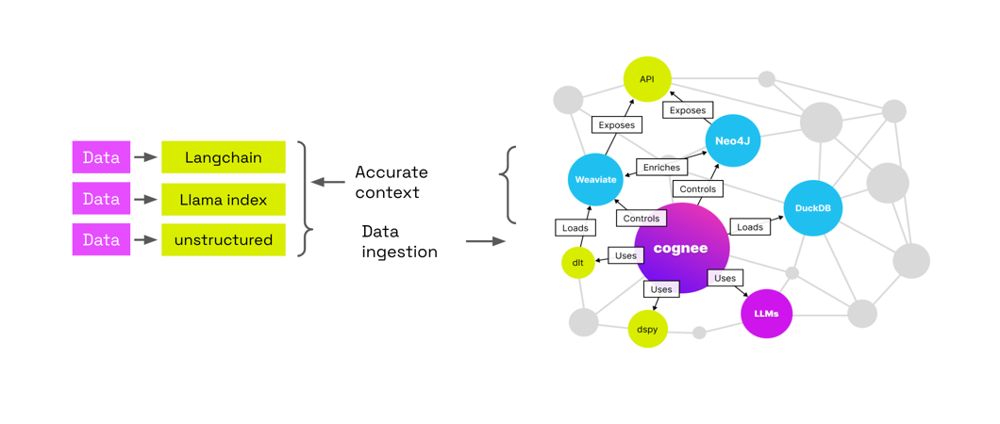

# cognee

Deterministic LLMs Outputs for AI Engineers using graphs, LLMs and vector retrieval


<p>
  <a href="https://cognee.ai" target="_blank">
    
  </a>
</p>


<p>
  <i>Open-source framework for creating self-improving deterministic outputs for LLMs.</i>
</p>

<p>
  <a href="https://github.com/topoteretes/cognee/fork">
    
  </a>
  <a href="https://github.com/topoteretes/cognee/stargazers">
    
  </a>
  <a href="https://github.com/topoteretes/cognee/pulls">
    
  </a>
  <a href="https://github.com/topoteretes/cognee/releases">
    
  </a>
</p>


Try it in a Google collab  <a href="https://colab.research.google.com/drive/11k0GtbrKRVGTxhcgad4Wl8YvCnWJVWPl?usp=sharing">notebook</a>  or have a look at our <a href="https://topoteretes.github.io/cognee">documentation</a>

Join our  <a href="https://discord.gg/NQPKmU5CCg">Discord</a> community


## 📦 Installation

With pip:

```bash
pip install "cognee[weaviate]"
```

With poetry:

```bash
poetry add "cognee[weaviate]"
```

## 💻 Usage

### Setup

```
import os

os.environ["WEAVIATE_URL"] = "YOUR_WEAVIATE_URL"
os.environ["WEAVIATE_API_KEY"] = "YOUR_WEAVIATE_API_KEY"

os.environ["OPENAI_API_KEY"] = "YOUR_OPENAI_API_KEY"

```
You can also use Ollama or Anyscale as your LLM provider. For more info on local models check our [docs](https://topoteretes.github.io/cognee)

### Run

```
import cognee

text = """Natural language processing (NLP) is an interdisciplinary
       subfield of computer science and information retrieval"""

cognee.add([text], "example_dataset") # Add a new piece of information

cognee.cognify() # Use LLMs and cognee to create knowledge

search_results = cognee.search("SIMILARITY", "computer science") # Query cognee for the knowledge

for result_text in search_results[0]:
    print(result_text)

```
Add alternative data types:
```
cognee.add("file://{absolute_path_to_file}", dataset_name)
```
Or
```
cognee.add("data://{absolute_path_to_directory}", dataset_name)

# This is useful if you have a directory with files organized in subdirectories.
# You can target which directory to add by providing dataset_name.
# Example:
#            root
#           /    \
#      reports  bills
#     /       \
#   2024     2023
#
# cognee.add("data://{absolute_path_to_root}", "reports.2024")
# This will add just directory 2024 under reports.
```

Read more [here](docs/index.md#run).

## Demo

Check out our demo notebook [here](https://github.com/topoteretes/cognee/blob/main/notebooks/cognee%20-%20Get%20Started.ipynb)


[](https://www.youtube.com/watch?v=BDFt4xVPmro "Learn about cognee: 55")


## How it works





## 🚀 It's alive

<p>
Try it yourself on Whatsapp with one of our <a href="https://keepi.ai" target="_blank">partners</a> by typing `/save {content you want to save}` followed by `/query {knowledge you saved previously}`
For more info here are the <a href="https://topoteretes.github.io/cognee">docs</a>
</p>
