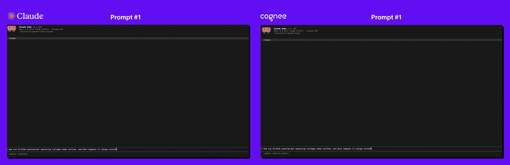

<div align="center">
  <a href="https://github.com/topoteretes/cognee">
    
  </a>

  <br />

  Cognee - The Open-Source AI Memory Platform for Agents

  <p align="center">
  <a href="https://www.youtube.com/watch?v=8hmqS2Y5RVQ&t=13s">Demo</a>
  .
  <a href="https://docs.cognee.ai/">Docs</a>
  .
  <a href="https://cognee.ai">Learn More</a>
  ·
  <a href="https://discord.gg/NQPKmU5CCg">Join Discord</a>
  ·
  <a href="https://www.reddit.com/r/AIMemory/">Join r/AIMemory</a>
  .
  <a href="https://github.com/topoteretes/cognee-community">Community Plugins & Add-ons</a>
  </p>


  [](https://GitHub.com/topoteretes/cognee/network/)
  [](https://GitHub.com/topoteretes/cognee/stargazers/)
  [](https://GitHub.com/topoteretes/cognee/commit/)
  [](https://github.com/topoteretes/cognee/tags/)
  [](https://pepy.tech/project/cognee)
  [](https://github.com/topoteretes/cognee/blob/main/LICENSE)
  [](https://github.com/topoteretes/cognee/graphs/contributors)
  <a href="https://github.com/sponsors/topoteretes"></a>

<p>
  <a href="https://trendshift.io/repositories/13955" target="_blank" style="display:inline-block;">
    
  </a>
</p>

Cognee is the open-source AI memory platform that gives AI agents persistent long-term memory across sessions. Ingest data in any format, build a self-hosted knowledge graph, and let every agent recall, connect, and act with full context

  <p align="center">
  🌐 This README is also available in:
  :
  <!-- Keep these links. Translations will automatically update with the README. -->
  <a href="https://www.readme-i18n.com/topoteretes/cognee?lang=de">Deutsch</a> |
  <a href="https://www.readme-i18n.com/topoteretes/cognee?lang=es">Español</a> |
  <a href="https://www.readme-i18n.com/topoteretes/cognee?lang=fr">Français</a> |
  <a href="https://www.readme-i18n.com/topoteretes/cognee?lang=ja">日本語</a> |
  <a href="README_ko.md">한국어</a> |
  <a href="https://www.readme-i18n.com/topoteretes/cognee?lang=pt">Português</a> |
  <a href="https://www.readme-i18n.com/topoteretes/cognee?lang=ru">Русский</a> |
  <a href="https://www.readme-i18n.com/topoteretes/cognee?lang=zh">中文</a>
  </p>

<p align="center">
  
</p>
</div>

📄 Read the research paper: [Optimizing the Interface Between Knowledge Graphs and LLMs for Complex Reasoning](https://arxiv.org/abs/2505.24478) — Markovic et al., 2025


## About Cognee

Cognee is an open-source AI memory platform for AI Agents. Ingest data in any format, and Cognee continuously builds a self-hosted knowledge graph that gives your agents persistent long-term memory across sessions. Cognee combines vector embeddings, graph reasoning, and cognitive-science-grounded ontology generation to make documents both searchable by meaning and connected by relationships that evolve as your knowledge does.

:star: _Help us reach more developers and grow the cognee community. Star this repo!_

:books: _Check our detailed [documentation](https://docs.cognee.ai/getting-started/installation#environment-configuration) for setup and configuration._

:crab: _Available as a plugin for your OpenClaw — [cognee-openclaw](https://www.npmjs.com/package/@cognee/cognee-openclaw)_

✴️ _Available as a plugin for your Claude Code — [claude-code-plugin](https://github.com/topoteretes/cognee-integrations/tree/main/integrations/claude-code)_

🦀 _Available as a Rust client — [cognee-rs](https://github.com/topoteretes/cognee-rs)_

🟦 _Available as a TypeScript client — [@cognee/cognee-ts](https://www.npmjs.com/package/@cognee/cognee-ts)_


### Why use Cognee:

- Easily Build Company Brain - unify data from various sources in one place and enable Agents with your domain knowledge
- Knowledge infrastructure — unified ingestion, graph/vector search, runs locally, ontology grounding, multimodal
- Persistent and Learning Agents - learn from feedback, context management, cross-agent knowledge sharing
- Reliable and Trustworthy Agents - agentic user/tenant isolation, traceability, OTEL collector, audit traits

### How it Works

<p align="center">
  
</p>

## Basic Usage & Feature Guide

To learn more, [check out this short, end-to-end Colab walkthrough](https://colab.research.google.com/drive/12Vi9zID-M3fpKpKiaqDBvkk98ElkRPWy?usp=sharing) of Cognee's core features.

[](https://colab.research.google.com/drive/12Vi9zID-M3fpKpKiaqDBvkk98ElkRPWy?usp=sharing)

## Quickstart

Let’s try Cognee in just a few lines of code.

### Prerequisites

- Python 3.10 to 3.14

### Step 1: Install Cognee

You can install Cognee with **pip**, **poetry**, **uv**, or your preferred Python package manager.

```bash
uv pip install cognee
```

### Step 2: Configure the LLM
```python
import os
os.environ["LLM_API_KEY"] = "YOUR OPENAI_API_KEY"
```
Alternatively, create a `.env` file using our [template](https://github.com/topoteretes/cognee/blob/main/.env.template).

To integrate other LLM providers, see our [LLM Provider Documentation](https://docs.cognee.ai/setup-configuration/llm-providers).

### Step 3: Run the Pipeline

Cognee's API gives you four operations — `remember`, `recall`, `forget`, and `improve`:

```python
import cognee
import asyncio


async def main():
    # Store permanently in the knowledge graph (runs add + cognify + improve)
    await cognee.remember("Cognee turns documents into AI memory.")

    # Store in session memory (fast cache, syncs to graph in background)
    await cognee.remember("User prefers detailed explanations.", session_id="chat_1")

    # Query with auto-routing (picks best search strategy automatically)
    results = await cognee.recall("What does Cognee do?")
    for result in results:
        print(result)

    # Query session memory first, fall through to graph if needed
    results = await cognee.recall("What does the user prefer?", session_id="chat_1")
    for result in results:
        print(result)

    # Delete when done
    await cognee.forget(dataset="main_dataset")


if __name__ == '__main__':
    asyncio.run(main())

```

### Use the Cognee CLI

```bash
cognee-cli remember "Cognee turns documents into AI memory."

cognee-cli recall "What does Cognee do?"

cognee-cli forget --all
```

To open the local UI, run:
```bash
cognee-cli -ui
```

> **Note:** The MCP server launched by `cognee-cli -ui` runs inside a Docker container.
> Docker Desktop, Colima, or any OCI-compatible runtime with a working `docker` CLI is
> required. See [Docker & Colima Setup](docs/docker-colima-setup.md) for details.

## Run with Docker

Prefer containers? Cognee publishes prebuilt images to Docker Hub on every push to `main`:
[`cognee/cognee`](https://hub.docker.com/r/cognee/cognee) (the API server) and
[`cognee/cognee-mcp`](https://hub.docker.com/r/cognee/cognee-mcp) (the MCP server).

### Option A — Docker Compose (build from source)

Clone the repo, create a `.env` with at least `LLM_API_KEY`, then:

```bash
cp .env.template .env   # then edit .env and set LLM_API_KEY

# Start the API server (http://localhost:8000)
docker compose up

# Optional profiles (combine as needed):
docker compose --profile ui up        # + frontend on http://localhost:3000
docker compose --profile mcp up       # + MCP server on http://localhost:8001
docker compose --profile postgres up  # + Postgres/PGVector
docker compose --profile neo4j up     # + Neo4j
```

> The `cognee` and `cognee-mcp` services publish different host ports (`8000` vs `8001`),
> so you can run both at once.

### Option B — Pull the prebuilt image (no clone required)

```bash
# Create a minimal .env in the current directory
echo 'LLM_API_KEY="YOUR_OPENAI_API_KEY"' > .env

# API server
docker run --env-file ./.env -p 8000:8000 --rm -it cognee/cognee:main

# MCP server (HTTP transport)
docker pull cognee/cognee-mcp:main
docker run -e TRANSPORT_MODE=http --env-file ./.env -p 8000:8000 --rm -it cognee/cognee-mcp:main
```

See the [MCP server README](cognee-mcp/README.md) for SSE/stdio transports, optional
extras, and MCP client configuration.

## Use with AI Agents

### Claude Code

Install the [Cognee memory plugin](https://github.com/topoteretes/cognee-integrations/tree/main/integrations/claude-code) to give Claude Code persistent memory across sessions. The plugin captures prompts, tool traces, and assistant responses into session memory, injects relevant context on every prompt, and syncs session memory into the permanent knowledge graph at session end.

**Install** from the Claude Code marketplace. The recommended way is from your shell, *before* launching Claude Code, so the first `claude` launch is a clean session that bootstraps memory automatically:

```bash
# Add the marketplace and install the plugin (one-time, user-scoped)
claude plugin marketplace add topoteretes/cognee-integrations
claude plugin install cognee-memory@cognee

# Set env vars for your mode (see below), then launch
export LLM_API_KEY="sk-..."   # local mode; or COGNEE_BASE_URL + COGNEE_API_KEY for cloud
claude
```

**Local mode** (default) — the plugin bootstraps a local Cognee API at `http://localhost:8011`. Only `LLM_API_KEY` is required; the Cognee API key is auto-minted if absent:

```bash
export LLM_API_KEY="sk-..."
```

**Cognee Cloud or a remote server** — set both:

```bash
export COGNEE_BASE_URL="https://your-instance.cognee.ai"
export COGNEE_API_KEY="ck_..."
```

On startup you should see a "Cognee Memory Connected" system message.

The plugin hooks into Claude Code's lifecycle — `SessionStart` selects mode and sets up identity, `UserPromptSubmit` injects dataset-scoped context, `PostToolUse` captures tool traces, `Stop` writes the assistant's answer, `PreCompact` preserves memory across context resets, and `SessionEnd` triggers the final sync into the permanent graph.

See the [plugin README](https://github.com/topoteretes/cognee-integrations/tree/main/integrations/claude-code) for sessions, datasets, and full configuration.

### Connect to Cognee Cloud

Point any Python agent at a managed Cognee instance — all SDK calls route to the cloud:

```python
import cognee

await cognee.serve(url="https://your-instance.cognee.ai", api_key="ck_...")

await cognee.remember("important context")
results = await cognee.recall("what happened?")

await cognee.disconnect()
```

## Examples

Browse more examples in the [`examples/`](examples/) folder — demos, guides, custom pipelines, and database configurations.

**Use Case 1 — Customer Support Agent**

```python
Goal: Resolve customer issues using their personal data across finance, support, and product history.

User: "My invoice looks wrong and the issue is still not resolved."

Cognee tracks: past interactions, failed actions, resolved cases, product history

# Agent response:
Agent: "I found 2 similar billing cases resolved last month.
        The issue was caused by a sync delay between payment
        and invoice systems — a fix was applied on your account."

# What happens under the hood:
- Unifies data sources from various company channels
- Reconstructs the interaction timeline and tracks outcomes
- Retrieves similar resolved cases
- Maps to the best resolution strategy
- Updates memory after execution so the agent never repeats the same mistake
```

**Use Case 2 — Expert Knowledge Distillation (SQL Copilot)**

```python
Goal: Help junior analysts solve tasks by reusing expert-level queries, patterns, and reasoning.

User: "How do I calculate customer retention for this dataset?"

Cognee tracks: expert SQL queries, workflow patterns, schema structures, successful implementations

# Agent response:
Agent: "Here's how senior analysts solved a similar retention query.
        Cognee matched your schema to a known structure and adapted
        the expert's logic to fit your dataset."

# What happens under the hood:
- Extracts and stores patterns from expert SQL queries and workflows
- Maps the current schema to previously seen structures
- Retrieves similar tasks and their successful implementations
- Adapts expert reasoning to the current context
- Updates memory with new successful patterns so junior analysts perform at near-expert level
```

## Run the Whole Memory Layer on Postgres

Graph memory traditionally means operating a stack — a graph database for relationships, a vector database for embeddings, Redis for sessions, and a relational database for metadata — all deployed, secured, and paid for before an agent remembers anything. In cognee 1.0 you can run the entire memory layer on a single Postgres instance.

| Memory layer | Traditional stack | cognee on Postgres |
| --- | --- | --- |
| Relationships | Neo4j or another graph database | cognee's Postgres graph backend |
| Embeddings | Dedicated vector database | pgvector |
| Sessions | Redis | SQL session-cache backend |
| Metadata | Relational database | same Postgres |

The graph still exists — it just lives inside the same Postgres-backed memory layer as the text, metadata, and embeddings, so retrieval moves between similarity and structure without crossing service boundaries. In our CI benchmarks, Postgres search ran ~10% faster than the separate graph-plus-vector setup.

Postgres is the default we recommend for most deployments, but you can still swap in dedicated backends when a workload needs them (Neo4j and Neptune for graphs, Redis for sessions, pgvector and LanceDB for vectors, plus Qdrant, ChromaDB, Weaviate, and Milvus via community adapters). Local development stays fully embedded — SQLite, LanceDB, and Kuzudb — with no extra services to stand up.

```bash
pip install "cognee[postgres]"
```

```bash
DB_PROVIDER=postgres
VECTOR_DB_PROVIDER=pgvector
GRAPH_DATABASE_PROVIDER=postgres
CACHE_BACKEND=postgres

DB_HOST=localhost
DB_PORT=5432
DB_USERNAME=cognee
DB_PASSWORD=cognee
DB_NAME=cognee_db
```

## Deploy Cognee

Use [Cognee Cloud](https://www.cognee.ai) for a fully managed experience, or self-host with one of the 1-click deployment configurations below.

| Platform | Best For | Command |
|----------|----------|---------|
| **Cognee Cloud** | Managed service, no infrastructure to maintain | [Sign up](https://www.cognee.ai) or `await cognee.serve()` |
| **Modal** | Serverless, auto-scaling, GPU workloads | `bash distributed/deploy/modal-deploy.sh` |
| **Railway** | Simplest PaaS, native Postgres | `railway init && railway up` |
| **Fly.io** | Edge deployment, persistent volumes | `bash distributed/deploy/fly-deploy.sh` |
| **Render** | Simple PaaS with managed Postgres | Deploy to Render button |
| **Daytona** | Cloud sandboxes (SDK or CLI) | See `distributed/deploy/daytona_sandbox.py` |

See the [`distributed/`](distributed/) folder for deploy scripts, worker configurations, and additional details.

## Use Cognee in Other Languages

Prefer something other than Python? Cognee also ships official clients for Rust and TypeScript.

### Getting Started with Rust

Use the [cognee-rs](https://github.com/topoteretes/cognee-rs) crate to add, cognify, and search from Rust.

```bash
cargo add cognee
```

See the [cognee-rs repository](https://github.com/topoteretes/cognee-rs) for full setup and examples.

### Getting Started with TypeScript

Use the [@cognee/cognee-ts](https://www.npmjs.com/package/@cognee/cognee-ts) package to add, cognify, and search from Node.js or the browser.

```bash
npm install @cognee/cognee-ts
```

See the [@cognee/cognee-ts package](https://www.npmjs.com/package/@cognee/cognee-ts) for full setup and examples.

## Benchmarks

We ran cognee against [BEAM](https://github.com/topoteretes/cognee), a long-context benchmark that tests whether a system can keep track of a long conversation as it changes — a more useful test for agent memory than typical needle-in-a-haystack benchmarks. Using only cognee's default settings and standard open-source features (no custom models, no BEAM-specific pipelines), we beat the previous state of the art at the 100K-token setting and matched it at 10M tokens.

| Benchmark | Setting | cognee | Previous SOTA | Obsidian / RAG baseline |
|-----------|---------|--------|---------------|--------------------------|
| BEAM | 100K tokens | **0.79** (>0.8 with per-question routing) | 0.735 | ~0.33 |
| BEAM | 10M tokens | **0.67** | 0.641 | ~0.33 |

These numbers are a directional signal rather than a definitive measure — see the write-up for the full methodology, caveats, and what the results actually mean.

## Latest News

[](https://www.youtube.com/watch?v=8hmqS2Y5RVQ&t=13s)


## Community & Support

### Contributing
We welcome contributions from the community! Your input helps make Cognee better for everyone. See [`CONTRIBUTING.md`](CONTRIBUTING.md) to get started.

### Code of Conduct

We're committed to fostering an inclusive and respectful community. Read our [Code of Conduct](https://github.com/topoteretes/cognee/blob/main/CODE_OF_CONDUCT.md) for guidelines.

## Research & Citation

We recently published a research paper on optimizing knowledge graphs for LLM reasoning:

```bibtex
@misc{markovic2025optimizinginterfaceknowledgegraphs,
      title={Optimizing the Interface Between Knowledge Graphs and LLMs for Complex Reasoning},
      author={Vasilije Markovic and Lazar Obradovic and Laszlo Hajdu and Jovan Pavlovic},
      year={2025},
      eprint={2505.24478},
      archivePrefix={arXiv},
      primaryClass={cs.AI},
      url={https://arxiv.org/abs/2505.24478},
}
```
