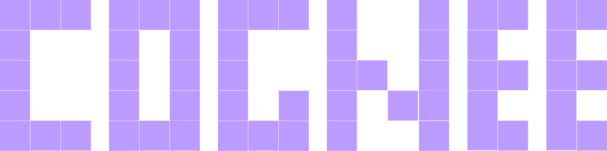
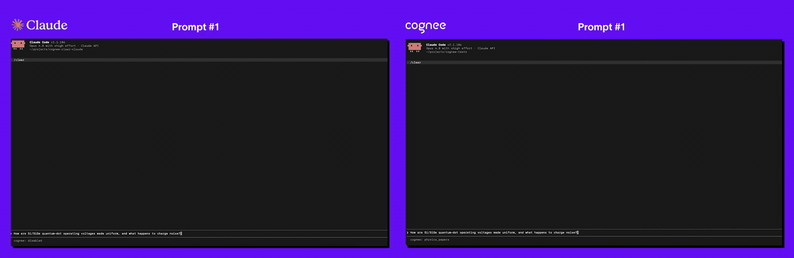
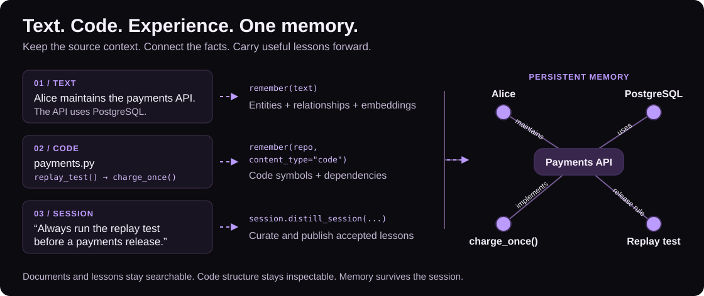
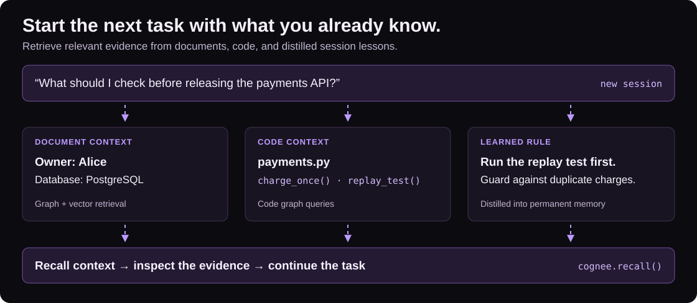

<div align="center">
  <a href="https://github.com/topoteretes/cognee">
    
  </a>

  <br />

  <p>Cognee - The Open-Source AI Memory Platform for Agents</p>

  <p align="center">
  <a href="https://www.youtube.com/watch?v=8hmqS2Y5RVQ&t=13s">Demo</a>
  .
  <a href="https://docs.cognee.ai/">Docs</a>
  .
  <a href="https://cognee.ai">Learn More</a>
  ·
  <a href="https://discord.gg/NQPKmU5CCg">Join Discord</a>
  ·
  <a href="https://www.reddit.com/r/AIMemory/">Join r/AIMemory</a>
  .
  <a href="https://github.com/topoteretes/cognee-community">Community Plugins & Add-ons</a>
  </p>


  <p>
  <a href="https://GitHub.com/topoteretes/cognee/network/"></a>
  <a href="https://github.com/topoteretes/cognee"></a>
  <a href="https://GitHub.com/topoteretes/cognee/commit/"></a>
  <a href="https://github.com/topoteretes/cognee/tags/"></a>
  <a href="https://pepy.tech/project/cognee"></a>
  <a href="https://github.com/topoteretes/cognee/blob/main/LICENSE"></a>
  <a href="https://github.com/topoteretes/cognee/graphs/contributors"></a>
  <a href="https://github.com/sponsors/topoteretes"></a>
  </p>

<p>
  <a href="https://trendshift.io/repositories/13955" target="_blank" style="display:inline-block;">
    
  </a>
</p>

  <p>Cognee is the open-source AI memory platform that gives AI agents persistent long-term memory across sessions. Turn documents, code, and conversations into a self-hosted knowledge graph your agents can search and reuse.</p>

  <p><strong>Start locally without an LLM or an OpenAI or Anthropic API key.</strong> Build memory from text with local extraction and embedding models. Add a local or hosted LLM when you want generated answers.</p>

  <p align="center">
  🌐 This README is also available in:<br />
  <!-- Keep these links. Translations will automatically update with the README. -->
  <a href="https://www.readme-i18n.com/topoteretes/cognee?lang=de">Deutsch</a> |
  <a href="https://www.readme-i18n.com/topoteretes/cognee?lang=es">Español</a> |
  <a href="https://www.readme-i18n.com/topoteretes/cognee?lang=fr">Français</a> |
  <a href="https://www.readme-i18n.com/topoteretes/cognee?lang=ja">日本語</a> |
  <a href="README_ko.md">한국어</a> |
  <a href="https://www.readme-i18n.com/topoteretes/cognee?lang=pt">Português</a> |
  <a href="https://www.readme-i18n.com/topoteretes/cognee?lang=ru">Русский</a> |
  <a href="https://www.readme-i18n.com/topoteretes/cognee?lang=zh">中文</a>
  </p>

<p align="center">
  
</p>
</div>

📄 Read the research paper: [Optimizing the Interface Between Knowledge Graphs and LLMs for Complex Reasoning](https://arxiv.org/abs/2505.24478) — Markovic et al., 2025

## When to use Cognee

- **Build a Company Brain.** Bring documentation, conversations, tickets, code, and agent work into shared memory. Help your team and agents connect a decision to the discussion and implementation behind it. [Explore Company Brain](https://www.cognee.ai/company-brain).
- **Give agents memory across runs.** Retain project context, past decisions, fixes, and learned rules. Distill useful session lessons into durable knowledge that another session can retrieve. [Connect your agent](#connect-your-agent).
- **Ground agents in your domain.** Structure memory around the entities and relationships your application needs, with custom data models and ontologies. [Explore ontologies](https://docs.cognee.ai/guides/ontology-support).

## Choose your starting point

| I want to… | Start here |
| --- | --- |
| Build memory from my own text without an LLM | [Local Python quickstart](#run-locally-without-an-llm) |
| Explore a prebuilt graph without downloading models | [Bundled demo](#explore-the-bundled-demo) |
| Generate answers with a local or hosted LLM | [Optional LLM setup](#optional-add-an-llm) |
| Give an existing agent memory | [Plugins and MCP](#connect-your-agent) |
| Run Cognee on my infrastructure | [Deployment options](#deploy-cognee) |
| Use a managed service | [Cognee Cloud](https://docs.cognee.ai/cognee-cloud/overview) |

## Quickstart

Requires **Python 3.10–3.14**. [Cognee v1.6.0](https://github.com/topoteretes/cognee/releases/tag/v1.6.0) supports building and searching text memory without a generative LLM or a cloud API key.

<a id="try-it-without-an-api-key"></a>

### Run locally without an LLM

In a fresh Python environment, install Cognee with the local extraction extra:

```bash
pip install --upgrade "cognee[gliner]"
```

You can also use `uv pip install --upgrade "cognee[gliner]"` in an activated environment.

Leave `LLM_API_KEY` and `EMBEDDING_*` settings unset in both your shell and `.env`, with no other LLM provider configured. Cognee automatically uses:

- **Local graph extraction:** the GLiNER demo model (`fastino/gliner2.5-base-v1`) extracts entities and relationships from text.
- **Local embeddings:** FastEmbed runs `BAAI/bge-small-en-v1.5` for semantic search.
- **Retrieval without generation:** `recall()` returns matching text chunks, ready for your application or agent to use.

The first run needs internet access to download the models (approximately **750 MB** for GLiNER and **67 MB** for embeddings); inference runs locally. No Ollama server is needed for this path.

Save this as `quickstart.py` and run `python quickstart.py`:

```python
import asyncio

import cognee


async def main():
    # Extract a knowledge graph and embed the text with local models.
    await cognee.remember(
        "Marie Curie was born in Warsaw and worked at the University of Paris.",
        dataset_name="local_quickstart",
    )

    # Retrieve the matching source text; no LLM generates an answer.
    results = await cognee.recall(
        "Where was Marie Curie born?",
        datasets=["local_quickstart"],
    )
    for result in results:
        print(result)


if __name__ == "__main__":
    asyncio.run(main())
```

The same workflow is available from the CLI:

```bash
cognee-cli remember "Marie Curie was born in Warsaw." -d local_quickstart
cognee-cli recall "Where was Marie Curie born?" -d local_quickstart
```

Text ingestion, retrieval, and session storage work without an LLM. LLM-dependent improvement stages skip automatically. Generated answers and media processing that requires a vision or transcription model need additional provider configuration.

> **GLiNER demo:** The open-source extractor is free to use and demonstrates Cognee's enterprise GLiNER extraction. The production-grade version with higher accuracy and broader label coverage is a licensed product. Contact [social@cognee.ai](mailto:social@cognee.ai) for details.

### Explore the bundled demo

To explore a prebuilt graph without downloading extraction or embedding models:

```bash
cognee-cli demo
```

This command works with the base `pip install cognee` package. It loads bundled sample data and runs keyword search without an API key. Use the local quickstart above to build a graph from your own text.

### Optional: add an LLM

For generated answers and LLM-based enrichment, configure [local models with Ollama](https://docs.cognee.ai/guides/local-ollama) or a [hosted provider such as OpenAI or Anthropic](https://docs.cognee.ai/setup-configuration/llm-providers). OpenAI and Anthropic are optional.

Configure embeddings separately when adding an LLM. To keep using the local dataset above, retain its embedding model with these `.env` settings:

```dotenv
EMBEDDING_PROVIDER=fastembed
EMBEDDING_MODEL=BAAI/bge-small-en-v1.5
```

Setting only `LLM_API_KEY` selects the OpenAI defaults for both LLM calls and embeddings. Changing the embedding model requires re-ingesting your data into a new dataset. See the [configuration template](.env.template) and [installation guide](https://docs.cognee.ai/getting-started/installation) for more options.

## How Cognee works

Cognee builds connected memory from different sources. Text becomes entities, relationships, and searchable chunks; code becomes a graph of symbols and dependencies. Session distillation curates accepted lessons into permanent memory.

<p align="center">
  
</p>

At query time, retrieval selects relevant graph, vector, or code context. Your application can inspect the retrieved evidence and use it to answer a question or continue an agent task.

<p align="center">
  
</p>

| Operation | What it does | Learn more |
| --- | --- | --- |
| `remember` | Store content or code in permanent memory, or in a session when a session ID is supplied. | [Store memory](https://docs.cognee.ai/core-concepts/main-operations/remember) |
| `recall` | Retrieve context and answers, using automatic routing or a chosen search strategy. | [Query memory](https://docs.cognee.ai/core-concepts/main-operations/recall) |
| `improve` | Enrich memory, apply feedback, and bridge session knowledge into the graph. | [Improve memory](https://docs.cognee.ai/core-concepts/main-operations/improve) |
| `forget` | Remove a specific item or dataset. | [Delete memory](https://docs.cognee.ai/core-concepts/main-operations/forget) |

Explore the [architecture](https://docs.cognee.ai/core-concepts/architecture) and [session lifecycle](https://docs.cognee.ai/core-concepts/sessions-and-caching).

## Connect your agent

Install the Claude Code plugin:

```bash
claude plugin marketplace add topoteretes/cognee-integrations
claude plugin install cognee-memory@cognee
```

or Codex plugin

Make sure to enable hooks:
```bash
# ~/.codex/config.toml
[features]
hooks = true
```

```bash
codex plugin marketplace add topoteretes/cognee-integrations --ref main
codex plugin add cognee@cognee
```

Follow the [plugin setup guide](https://github.com/topoteretes/cognee-integrations/tree/main/integrations/claude-code) to configure local or remote memory.

| Interface | Start here |
| --- | --- |
| Claude Code memory plugin | [Install and configure the plugin](https://github.com/topoteretes/cognee-integrations/tree/main/integrations/claude-code) |
| OpenClaw memory plugin | [Install `@cognee/cognee-openclaw`](https://www.npmjs.com/package/@cognee/cognee-openclaw) |
| Cursor, Cline, and other MCP clients | [Cognee MCP guide](https://docs.cognee.ai/cognee-mcp/mcp-overview) and [server README](cognee-mcp/README.md) |
| Python applications | [Python API reference](https://docs.cognee.ai/python-api) |
| TypeScript applications | [TypeScript SDK](https://docs.cognee.ai/typescript/getting-started) |
| Rust applications | [Cognee-RS](https://github.com/topoteretes/cognee-rs) |
| Applications using HTTP | [REST API reference](https://docs.cognee.ai/api-reference/introduction) |

Browse the [integrations repository](https://github.com/topoteretes/cognee-integrations) for agent frameworks, plugins, and source connectors. Each guide describes its setup and memory capture behavior.

To inspect a local installation in the UI:

```bash
cognee-cli -ui
```

The UI launcher requires Node.js/npm; Docker is needed for its MCP service. See [local UI setup](https://docs.cognee.ai/cognee-cli/overview).

## Explore examples

- [Build a small Company Brain from text, code, and session lessons](examples/demos/company_brain/company_brain_demo.py).
- [Import memory from Mem0, Letta, Zep, or Graphiti](https://docs.cognee.ai/examples/migrate-memory-systems) using the COGX exchange format.
- [Run with local Ollama models](https://docs.cognee.ai/guides/local-ollama), including a local embedding model.
- [Visualize your knowledge graph](https://docs.cognee.ai/guides/graph-visualization) and inspect its connections.
- [Browse runnable examples](examples/README.md) for ingestion, sessions, feedback, and custom pipelines.
- [Run the prebuilt API with Docker Compose](docs/minimal-docker-compose.md) or use the [deployment templates](distributed/deploy/README.md).
- [Explore community adapters and add-ons](https://github.com/topoteretes/cognee-community).

<a id="run-with-docker"></a>

## Deploy Cognee

For a local API demo using a prebuilt image, follow the [minimal Docker Compose guide](docs/minimal-docker-compose.md). It includes a persistent-volume configuration and explains the single-user demo settings.

To run the API, UI, and MCP server from a source checkout, clone this repository, enter its directory, copy [`.env.template`](.env.template) to `.env`, and configure your providers. Then run:

```bash
docker compose --profile ui --profile mcp up
```

The default ports are API **8000**, UI **3000**, and MCP **8001**. For deployment beyond a local demo, configure authentication, persistent storage, and compatible backends using the [permissions guide](https://docs.cognee.ai/setup-configuration/permissions) and [deployment templates](distributed/deploy/README.md). [Cognee Cloud](https://docs.cognee.ai/cognee-cloud/overview) provides the managed option.

The default Docker image does not include GLiNER. To ingest text without an LLM in Docker, add the `gliner` extra to your image; the local quickstart installs it explicitly.

## Run the Whole Memory Layer on Postgres

Graph memory traditionally means operating a stack — a graph database for relationships, a vector database for embeddings, Redis for sessions, and a relational database for metadata — all deployed, secured, and paid for before an agent remembers anything. In cognee 1.0 you can run the entire memory layer on a single Postgres instance.

> **⚠️ Warning:** Using Postgres as a graph store is currently a released as a demo feature. The production ready feature is available as a licenced product. Use it to demo keeping relational metadata, PGVector, and graph working together

<a id="benchmarks"></a>

## Benchmarks and research

The [BEAM evaluation](cognee/eval_framework/beam/REPORT.md) measures conversational memory using synthetic long-context conversations and an LLM judge. The reported runs use Cognee's memory components with benchmark-specific data formatting, prompts, and retrieval configuration.

| BEAM context | Reported score (0–1) | Scope |
| --- | --- | --- |
| 100K tokens | **0.79** | Fixed hybrid retrieval; four evaluation rounds over 20 questions from one held-out conversation. |
| 10M tokens | **0.67** | Exploratory result; question-type routing selected and scored on the same question set, averaged over five rounds. |

The two settings use different conversations, ingestion models, and retrieval-selection procedures. Read the [methodology, models, limitations, and reproduction instructions](cognee/eval_framework/beam/REPORT.md) before comparing these scores with other systems. The report also documents the remaining reproduction gap for the distributed 10M ingestion.

For the research behind Cognee's graph/LLM interface, see [Optimizing the Interface Between Knowledge Graphs and LLMs for Complex Reasoning](https://arxiv.org/abs/2505.24478) (Markovic et al., 2025).

## Latest News

[](https://www.youtube.com/watch?v=8hmqS2Y5RVQ&t=13s)

- **[v1.6.0 — Keyless workflows & pipeline reliability](https://github.com/topoteretes/cognee/releases/tag/v1.6.0)** (September 18, 2026): build and search text memory with local models and no cloud LLM key.
- Local model downloads are announced on first use, and LLM-dependent improvement stages skip when no LLM is configured.
- Pipeline recovery preserves completed documents after crashes, and datasets track their embedding model to prevent mismatches.


## Community & Support

### Contributing
We welcome contributions from the community! Your input helps make Cognee better for everyone. See [`CONTRIBUTING.md`](CONTRIBUTING.md) to get started.

### Code of Conduct

We're committed to fostering an inclusive and respectful community. Read our [Code of Conduct](https://github.com/topoteretes/cognee/blob/main/CODE_OF_CONDUCT.md) for guidelines.

## Research & Citation

We recently published a research paper on optimizing knowledge graphs for LLM reasoning:

```bibtex
@misc{markovic2025optimizinginterfaceknowledgegraphs,
      title={Optimizing the Interface Between Knowledge Graphs and LLMs for Complex Reasoning},
      author={Vasilije Markovic and Lazar Obradovic and Laszlo Hajdu and Jovan Pavlovic},
      year={2025},
      eprint={2505.24478},
      archivePrefix={arXiv},
      primaryClass={cs.AI},
      url={https://arxiv.org/abs/2505.24478},
}
```
