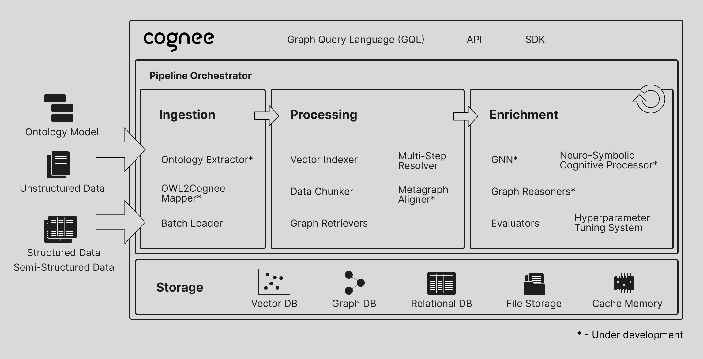

<div align="center">
  <a href="https://github.com/topoteretes/cognee">
    
  </a>

  <br />

  cognee - memory layer for AI apps and Agents

  [](https://GitHub.com/topoteretes/cognee/network/)
  [](https://GitHub.com/topoteretes/cognee/stargazers/)
  [](https://GitHub.com/topoteretes/cognee/commit/)
  [](https://github.com/topoteretes/cognee/tags/)
  [](https://pepy.tech/project/cognee)
  [](https://github.com/topoteretes/cognee/blob/main/LICENSE)
  [](https://github.com/topoteretes/cognee/graphs/contributors)

  AI Agent responses you can rely on.


Build dynamic Agent memory using scalable, modular ECL (Extract, Cognify, Load) pipelines.

More on [use-cases](https://docs.cognee.ai/use_cases).
</div>


## Features

1. Interconnect and retrieve your past conversations, documents, images and audio transcriptions
2. Reduce hallucinations, developer effort, and cost.
3. Load data to graph and vector databases using only Pydantic
4. Manipulate your data while ingesting from 30+ data sources

## Get Started

Get started quickly with a Google Colab  <a href="https://colab.research.google.com/drive/1g-Qnx6l_ecHZi0IOw23rg0qC4TYvEvWZ?usp=sharing">notebook</a>  or  <a href="https://github.com/topoteretes/cognee-starter">starter repo</a>? 

Confused? Ask questions on our  <a href="https://discord.gg/NQPKmU5CCg">Discord</a>.


<div style="text-align: center">
  
</div>


## 📦 Installation

You can install Cognee using either **pip**, **poetry**, **uv** or any other python package manager.

### With pip

```bash
pip install cognee
```

## 💻 Basic Usage

### Setup

```
import os
os.environ["LLM_API_KEY"] = "YOUR OPENAI_API_KEY"

```

You can also set the variables by creating .env file, here is our <a href="https://github.com/topoteretes/cognee/blob/main/.env.template">template.</a>
To use different LLM providers, for more info check out our <a href="https://docs.cognee.ai">documentation</a>


### Simple example

Add LLM_API_KEY to .env using the command bellow. 
```
echo "LLM_API_KEY=YOUR_OPENAI_API_KEY" > .env
```
You can see available env variables in the repository `.env.template` file.

This script will run the default pipeline:

```python
import cognee
import asyncio
from cognee.modules.search.types import SearchType

async def main():
    # Create a clean slate for cognee -- reset data and system state
    await cognee.prune.prune_data()
    await cognee.prune.prune_system(metadata=True)
    # cognee knowledge graph will be created based on this text
    text = """
    Natural language processing (NLP) is an interdisciplinary
    subfield of computer science and information retrieval.
    """

    print("Adding text to cognee:")
    print(text.strip())
    # Add the text, and make it available for cognify
    await cognee.add(text)

    # Use LLMs and cognee to create knowledge graph
    await cognee.cognify()
    print("Cognify process complete.\n")


    query_text = "Tell me about NLP"
    print(f"Searching cognee for insights with query: '{query_text}'")
    # Query cognee for insights on the added text
    search_results = await cognee.search(
        query_text=query_text, query_type=SearchType.INSIGHTS
    )

    print("Search results:")
    # Display results
    for result_text in search_results:
        print(result_text)

    # Example output:
       # ({'id': UUID('bc338a39-64d6-549a-acec-da60846dd90d'), 'updated_at': datetime.datetime(2024, 11, 21, 12, 23, 1, 211808, tzinfo=datetime.timezone.utc), 'name': 'natural language processing', 'description': 'An interdisciplinary subfield of computer science and information retrieval.'}, {'relationship_name': 'is_a_subfield_of', 'source_node_id': UUID('bc338a39-64d6-549a-acec-da60846dd90d'), 'target_node_id': UUID('6218dbab-eb6a-5759-a864-b3419755ffe0'), 'updated_at': datetime.datetime(2024, 11, 21, 12, 23, 15, 473137, tzinfo=datetime.timezone.utc)}, {'id': UUID('6218dbab-eb6a-5759-a864-b3419755ffe0'), 'updated_at': datetime.datetime(2024, 11, 21, 12, 23, 1, 211808, tzinfo=datetime.timezone.utc), 'name': 'computer science', 'description': 'The study of computation and information processing.'})
       # (...)
        #
        # It represents nodes and relationships in the knowledge graph:
        # - The first element is the source node (e.g., 'natural language processing').
        # - The second element is the relationship between nodes (e.g., 'is_a_subfield_of').
        # - The third element is the target node (e.g., 'computer science').

if __name__ == '__main__':
    asyncio.run(main())

```
For more advanced usage, have a look at our <a href="https://docs.cognee.ai"> documentation</a>.


## Understand our architecture

Cognee consists of tasks that can be grouped into pipelines.
Each task can be an independent part of business logic, that can be tied to other tasks to form a pipeline.
These tasks persist data into your memory store enabling you to search for relevant context of past conversations, documents, or any other data you have stored.
<div style="text-align: center">
  
</div>


## Demos

What is AI memory:


[](https://www.youtube.com/watch?v=fI4hDzguN5k "Learn about cognee: 55")

cognee in 4 minutes: 


[](https://www.youtube.com/watch?v=1bezuvLwJmw "cognee in 4 minutes: 55")


## Contributing

Your contributions are at the core of making this a true open source project. Any contributions you make are **greatly appreciated**. See [`CONTRIBUTING.md`](CONTRIBUTING.md) for more information.

## Code of Conduct

We are committed to making open source an enjoyable and respectful experience for our community. See <a href="https://github.com/topoteretes/cognee/blob/main/CODE_OF_CONDUCT.md"><code>CODE_OF_CONDUCT</code></a> for more information.

## 💫 Contributors

<a href="https://github.com/topoteretes/cognee/graphs/contributors">
  
</a>


## Star History

[](https://star-history.com/#topoteretes/cognee&Date)


