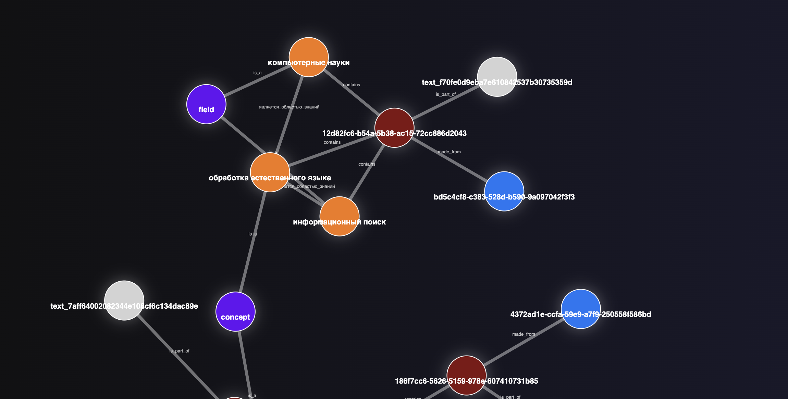

<div align="center">
  <a href="https://github.com/topoteretes/cognee">
    
  </a>

  <br />

Cognee - это платформа для управления памятью ИИ, предназначенная для повышения точности и надежности ответов больших языковых моделей (LLM) и ИИ-агентов.

<p align="center">
  <a href="https://www.youtube.com/watch?v=1bezuvLwJmw&t=2s">Демо</a>
  ·
  <a href="https://cognee.ai">Узнать больше</a>
  ·
  <a href="https://discord.gg/NQPKmU5CCg">Присоединиться к Discord</a>
</p>


  [](https://GitHub.com/topoteretes/cognee/network/)
  [](https://GitHub.com/topoteretes/cognee/stargazers/)
  [](https://GitHub.com/topoteretes/cognee/commit/)
  [](https://github.com/topoteretes/cognee/tags/)
  [](https://pepy.tech/project/cognee)
  [](https://github.com/topoteretes/cognee/blob/main/LICENSE)
  [](https://github.com/topoteretes/cognee/graphs/contributors)

<a href="https://www.producthunt.com/posts/cognee?embed=true&utm_source=badge-top-post-badge&utm_medium=badge&utm_souce=badge-cognee" target="_blank"></a>


Создавай динамическую память для агентов, используя ECL (Extract -> Cognify -> Load) конвейер.

Узнайте больше о [вариантах использования](https://docs.cognee.ai/use-cases) и [бенчмарках](https://github.com/topoteretes/cognee/tree/main/evals)

<div style="text-align: center">
  
</div>

</div>


## Функциональность

- Интеграция и извлечение данных: Позволяет подключать и извлекать прошлые разговоры, документы, изображения и аудиозаписи, обеспечивая доступ к разнообразным источникам информации.

- Снижение галлюцинаций и затрат: Уменьшает вероятность генерации недостоверных ответов, снижает затраты на разработку и эксплуатацию ИИ-приложений.

- Загрузка данных с использованием Pydantic: Обеспечивает загрузку данных в графовые и векторные базы данных с использованием только Pydantic, упрощая процесс интеграции.

- Трансформация и организация данных: Позволяет трансформировать и структурировать данные, собирая их из более чем 30 различных источников, включая PDF, таблицы и другие форматы.

- Модульные ECL-пайплайны: Использует модульные пайплайны Extract, Cognify, Load (ECL) для обработки данных, что обеспечивает гибкость и масштабируемость системы.

- Поддержка онтологий на основе RDF: Использует онтологии на основе RDF для более интеллектуального управления данными и улучшения семантического понимания.

- Локальное развертывание и масштабируемость: Позволяет развернуть систему на собственных серверах, обеспечивая безопасность данных и соответствие требованиям конфиденциальности. Система масштабируется для обработки больших объемов данных.

## Начало работы

Начните легко с помощью Google Colab <a href="https://colab.research.google.com/drive/1g-Qnx6l_ecHZi0IOw23rg0qC4TYvEvWZ?usp=sharing">блокнота</a> или <a href="https://github.com/topoteretes/cognee-starter">стартового репозитория</a>

## Помощь проекту

Ваш вклад является основой для превращения этого в настоящий проект с открытым исходным кодом. Любой вклад, который вы сделаете, будет **очень приветствоваться**. Смотрите [`CONTRIBUTING.md`](/CONTRIBUTING.md) для получения дополнительной информации.

## 📦 Установка

Вы можете установить Cognee, используя **pip**, **poetry**, **uv** или любой другой менеджер пакетов Python.

### С помощью pip

```bash
pip install cognee
```

## 💻 Базовое использование

### Настройка

```python
import os
os.environ["LLM_API_KEY"] = "ВАШ_OPENAI_API_KEY"
```

Вы также можете установить переменные, создав файл .env, используя наш <a href="https://github.com/topoteretes/cognee/blob/main/.env.template">шаблон</a>.
Для использования различных провайдеров LLM смотрите нашу <a href="https://docs.cognee.ai">документацию</a>.

### Пример использования

Этот скрипт выполнит *стандартный* конвейер:

```python
import cognee
import asyncio


async def main():
    # Добавляем текст в cognee
    await cognee.add("Обработка естественного языка (NLP) - это междисциплинарная область компьютерных наук и информационного поиска.")

    # Генерируем граф знаний
    await cognee.cognify()

    # Делаем поиск
    results = await cognee.search("Расскажите мне о NLP")

    # Отображаем результаты
    for result in results:
        print(result)


if __name__ == '__main__':
    asyncio.run(main())

```
Пример вывода:
```
Обработка естественного языка (NLP) — это междисциплинарная область, которая объединяет компьютерные науки и информационный поиск. Она включает в себя технологии и методы обработки человеческого языка для создания интерфейсов и обработки данных.
```

Визуализация графа:
<a href="https://rawcdn.githack.com/topoteretes/cognee/refs/heads/main/assets/graph_visualization.html"></a>
[Открыть пример графа в браузере](https://rawcdn.githack.com/topoteretes/cognee/refs/heads/main/assets/graph_visualization.html).


Больше примеров в <a href="https://docs.cognee.ai">документации</a>.


## Изучите нашу архитектуру

<div style="text-align: center">
  
</div>

## Демонстрации

1. Что такое память ИИ:
[Видео](https://github.com/user-attachments/assets/8b2a0050-5ec4-424c-b417-8269971503f0)

2. Простая демонстрация GraphRAG
[Видео](https://github.com/user-attachments/assets/d80b0776-4eb9-4b8e-aa22-3691e2d44b8f)

3. Cognee с Ollama 
[Видео](https://github.com/user-attachments/assets/8621d3e8-ecb8-4860-afb2-5594f2ee17db)

## Правила поведения

Мы стремимся сделать открытый исходный код приятным и уважительным опытом для нашего сообщества. Смотрите <a href="/CODE_OF_CONDUCT.md"><code>CODE_OF_CONDUCT</code></a> для получения дополнительной информации.

## 💫 Контрибьюторы

<a href="https://github.com/topoteretes/cognee/graphs/contributors">
  
</a>

## История звёзд на GitHub

[](https://star-history.com/#topoteretes/cognee&Date)
