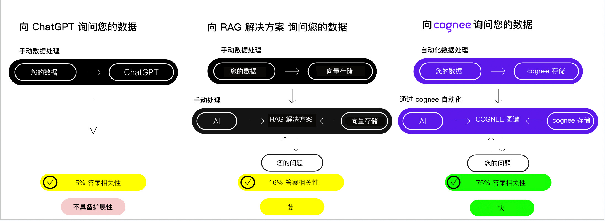
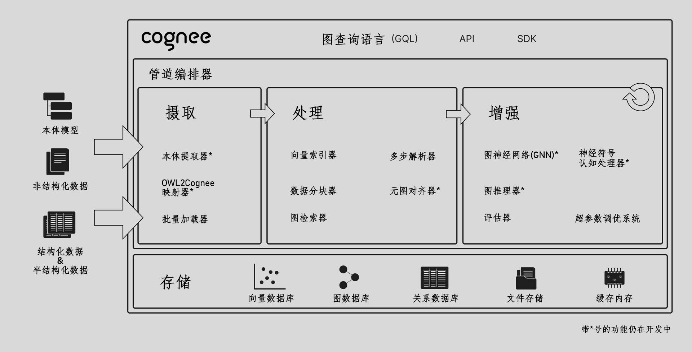

<div align="center">
  <a href="https://github.com/topoteretes/cognee">
    
  </a>

  <br />

  cognee - AI应用和智能体的记忆层

  <p align="center">
  <a href="https://www.youtube.com/watch?v=1bezuvLwJmw&t=2s">演示</a>
  .
  <a href="https://cognee.ai">了解更多</a>
  ·
  <a href="https://discord.gg/NQPKmU5CCg">加入Discord</a>
  </p>


  [](https://GitHub.com/topoteretes/cognee/network/)
  [](https://GitHub.com/topoteretes/cognee/stargazers/)
  [](https://GitHub.com/topoteretes/cognee/commit/)
  [](https://github.com/topoteretes/cognee/tags/)
  [](https://pepy.tech/project/cognee)
  [](https://github.com/topoteretes/cognee/blob/main/LICENSE)
  [](https://github.com/topoteretes/cognee/graphs/contributors)

  可靠的AI智能体响应。


使用可扩展、模块化的ECL（提取、认知、加载）管道构建动态智能体记忆。

更多[使用场景](https://docs.cognee.ai/use_cases)。

<div style="text-align: center">
  
</div>

</div>


## 功能特性

- 互联并检索您的历史对话、文档、图像和音频转录
- 减少幻觉、开发人员工作量和成本
- 仅使用Pydantic将数据加载到图形和向量数据库
- 从30多个数据源摄取数据时进行数据操作

## 开始使用

通过Google Colab <a href="https://colab.research.google.com/drive/1g-Qnx6l_ecHZi0IOw23rg0qC4TYvEvWZ?usp=sharing">笔记本</a>或<a href="https://github.com/topoteretes/cognee-starter">入门项目</a>快速上手

## 贡献
您的贡献是使这成为真正开源项目的核心。我们**非常感谢**任何贡献。更多信息请参阅[`CONTRIBUTING.md`](CONTRIBUTING.md)。


## 📦 安装

您可以使用**pip**、**poetry**、**uv**或任何其他Python包管理器安装Cognee。

### 使用pip

```bash
pip install cognee
```

## 💻 基本用法

### 设置

```
import os
os.environ["LLM_API_KEY"] = "YOUR OPENAI_API_KEY"

```

您也可以通过创建.env文件设置变量，使用我们的<a href="https://github.com/topoteretes/cognee/blob/main/.env.template">模板</a>。
要使用不同的LLM提供商，请查看我们的<a href="https://docs.cognee.ai">文档</a>获取更多信息。


### 简单示例

此脚本将运行默认管道：

```python
import cognee
import asyncio


async def main():
    # Add text to cognee
    await cognee.add("自然语言处理（NLP）是计算机科学和信息检索的跨学科领域。")

    # Generate the knowledge graph
    await cognee.cognify()

    # Query the knowledge graph
    results = await cognee.search("告诉我关于NLP")

    # Display the results
    for result in results:
        print(result)


if __name__ == '__main__':
    asyncio.run(main())

```
示例输出：
```
  自然语言处理（NLP）是计算机科学和信息检索的跨学科领域。它关注计算机和人类语言之间的交互，使机器能够理解和处理自然语言。
  
```
图形可视化：
<a href="https://rawcdn.githack.com/topoteretes/cognee/refs/heads/main/assets/graph_visualization.html"></a>
在[浏览器](https://rawcdn.githack.com/topoteretes/cognee/refs/heads/main/assets/graph_visualization.html)中打开。

有关更高级的用法，请查看我们的<a href="https://docs.cognee.ai">文档</a>。


## 了解我们的架构

<div style="text-align: center">
  
</div>


## 演示

1. 什么是AI记忆：

[了解cognee](https://github.com/user-attachments/assets/8b2a0050-5ec4-424c-b417-8269971503f0)

2. 简单GraphRAG演示

[简单GraphRAG演示](https://github.com/user-attachments/assets/f57fd9ea-1dc0-4904-86eb-de78519fdc32)

3. cognee与Ollama

[cognee与本地模型](https://github.com/user-attachments/assets/834baf9a-c371-4ecf-92dd-e144bd0eb3f6)


## 行为准则

我们致力于为我们的社区提供愉快和尊重的开源体验。有关更多信息，请参阅<a href="https://github.com/topoteretes/cognee/blob/main/CODE_OF_CONDUCT.md"><code>CODE_OF_CONDUCT</code></a>。

## 💫 贡献者

<a href="https://github.com/topoteretes/cognee/graphs/contributors">
  
</a>


## Star历史

[](https://star-history.com/#topoteretes/cognee&Date)
