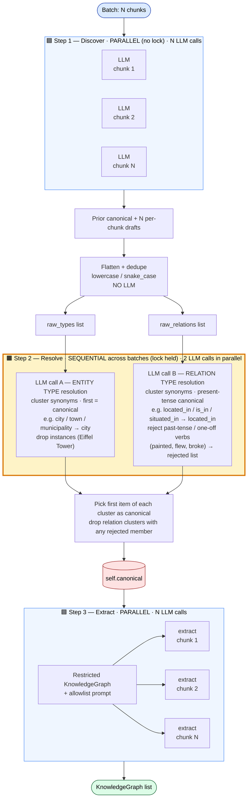
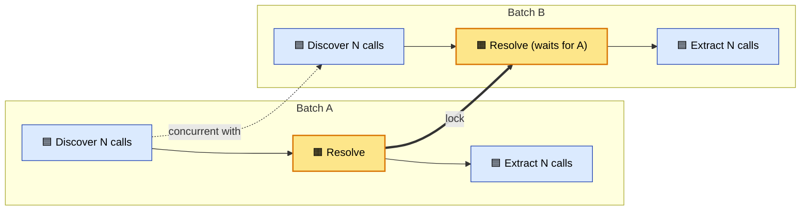
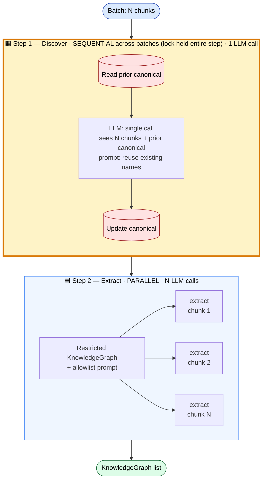
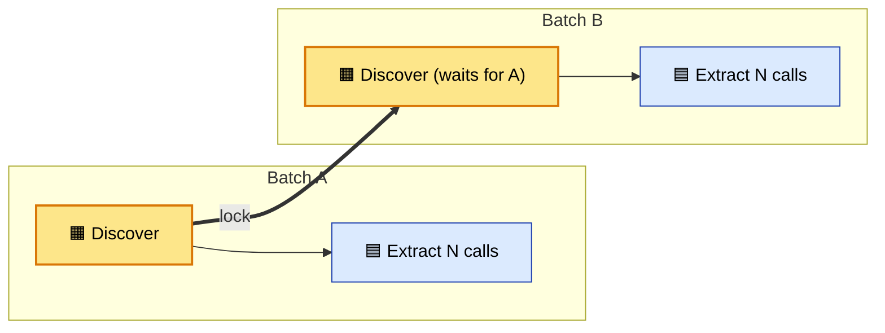

# Auto-Restricted Ontology

Legend: 🟦 **PARALLEL** &nbsp;|&nbsp; 🟧 **SEQUENTIAL (lock held — only one batch at a time)** &nbsp;|&nbsp; 🟥 mutable state

---

## Approach 1 — `AUTO_RESTRICTED`
Per-chunk discovery, then a 2-call resolve under a lock. **Cost per batch: N + 2 LLM calls.**

### Single-batch flow

### Across batches (2 batches running concurrently)

> Only **resolve** is serialized. Discovery and extraction of multiple batches overlap freely.

---

## Approach 2 — `AUTO_RESTRICTED_ITERATIVE`
One discovery call per batch, prior canonical injected as context. **Cost per batch: 1 LLM call.**

### Single-batch flow

### Across batches (2 batches running concurrently)

> The **entire discovery** is serialized. Batch B can't start discovery until Batch A finishes its single LLM call. Extraction across batches still overlaps.
