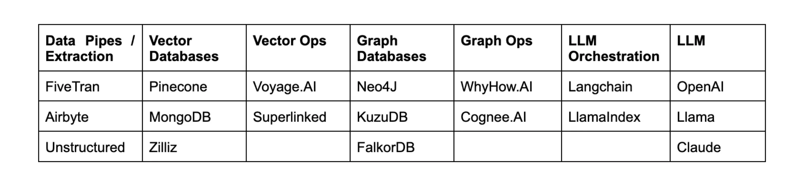

# LLMOps stack + Graphs

### **The past: Berlin startup scene**

Machine learning has had its place in the business models of companies for several years, but due to high labor costs, lack of generalizability, and long development cycles, it often did not meet the early days' expectations. With the rise of ChatGPT, however, foundation models and LLMs are reemerging as the next step in the evolution in the Machine Learning stack, democratizing it for the end users.

As a consultant and operator in the Berlin startup scene over the past ten years, I have seen the vocation of “Data Scientist” reflect this trend as well. Its initial popularity, decline, and resurgence easily could have mirrored the rise and fall of the Roman Empire. Humble beginnings, grandiosity, and then the rigidity of thought of early Christianity. 

In my early years as a data analyst in tier-II e-commerce businesses, data science was considered a prestigious, cutting-edge title. However,  most of these ventures lacked the experience or maturity to properly productionize their business models.

Often, I would see a data scientist building tons of features for their company’s AI models to only slightly improve on their basic KPIs. They were often stuck in the limbo of demoware, and only the businesses in which data was a key operational element would successfully deploy and run data science systems at scale.

---

### **Pandemic and fall out of grace**

Over the years, this low impact-high drain dynamic led to data science falling out of favor. The COVID pandemic seemed to deliver a death blow to the Berlin Data Science community, with many data scientists being made redundant.

This played out differently in larger markets and companies, where I saw more mature setups heavily relying on machine learning. However, from the perspective of most software *Mittelstand* (a German term for medium-sized enterprises), the technology was seen as a nice-to-have, not a must-have.

Suddenly, with the release of ChatGPT, most knowledge previously required to operate machine learning became obsolete,  with the only thing now needed being an API key. This dropped the barrier to entry to the floor and created a need for new tools to be built around these APIs.

Tools like Langchain met this need perfectly, enabling everyone to interact with their data.

### **ML to LLMOps**

A question arises about how we should approach LLM tooling. Ignoring previous knowledge and inferring new paradigms(Agents come to mind)  as if in a vacuum can be counterproductive. Re-inventing categories should be done cautiously; history shows that overdoing it can lead to failure.

A recently published article by angel investor and Professor of Neuroscience at U.C. London, Peter Zhegin, has effectively mapped out the elements of the MLOps system ripe for disruption, suggesting which ones might be impacted:

1. **Vector Stores**: The authors argue that data storage and vector stores will be acquired by large players, but that differentiation still may be possible in the data space. They state that "A realistic way to differentiate might be to push for real-time vectorization while finding the best way to use traditional databases and feature stores (relational/NoSQL) together with vector DBs."
2. **Feature Storage**: The authors note that "Prompt engineering does not involve traditional training but allows one to change the model's behavior during inference by creating appropriate instructions or queries. This ‘training without training’ presents an interesting opportunity outside the MLOps pipeline."

### **Feature Stores and the Next Steps**

The evolution of the MLOps stack signals a need for a new type of feature store that enables in-context learning.

Since fine-tuning LLMs will start happening at inference time, we need a system to interact with and manage data points fed to the LLM at scale. This implies a need for a feature store that provides more determinism to the LLM outputs, enabling the integration of business processes and practices into data that captures the context of an enterprise or organization.

An example of such a use case would be using a set of documents from different departments, enabling the LLM to understand the relationships between these documents and their individual parts.

This effort often requires humans to provide the base rules for how the LLM should interact with the information, leading to the creation of what is commonly referred to as a RAG (Retrieval Augmented Generation) pipeline.

---

Since recently, we’ve been able to combine graphs and vector data stores to create a semantic layer on top of naive RAGs. This layer has been a major step towards encoding rules into an in-context learning pipeline.

In [his recent blog post](https://medium.com/enterprise-rag/understanding-the-knowledge-graph-rag-opportunity-694b61261a9c), co-founder of WhyHow.AI, Chia Jeng Yang, explained what a typical RAG pipeline looks like. He also introduced Graph Ops and Vector Ops as new elements of the RAG stack which can lead to more stable retrieval patterns.

The argument Zhegin [made a few months ago is now taking shape](https://investingbyapproximation.substack.com/p/the-stunning-rise-of-llmops-navigating?r=2jos7&utm_campaign=post&utm_medium=web&triedRedirect=true). We are seeing feature stores evolve into tools that manage vector and graph stores.

We are still in the early stages, though. As Jon Turrow of Madrona Ventures  [**suggests**](https://www.madrona.com/the-rise-of-ai-agent-infrastructure/), the next generation of AI agent infrastructure—what Chia refers to as Graph Ops—will be a personalization layer.

---

I believe that these terms are interchangeable and that a new in-context Feature Store, Vector and Graph Ops, and personalization layers are essentially the same thing. Moreover, it’s my belief that Vector and Graph Ops are not differentiation categories in and of themselves.

The challenge is, thus, not connecting Vector and Graph stores or giving a RAG system a 10% performance boost.

The main issues still remain

The challenge and solution lie in creating a new type of probabilistic data engine—one with an interface as simple as SQL, but which can retrieve and structure information in real-time, optimizing what we feed the LLM based on solid evaluations.

---

Striving to make sense of the best computing engine we know of—our mind—cognitive sciences may offer us clues on how to move forward.

After all, we process, store, and retrieve data from our mental lexicon with ease, with inherent personalization and dynamic data enrichment.

I believe that understanding the way our mind carries out these processes may allow us to replicate them in machine learning.

With human language as the new SQL and cognitive theories as inspiration, the next generation of tooling is still on the horizon.

