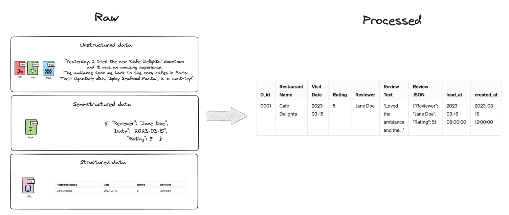
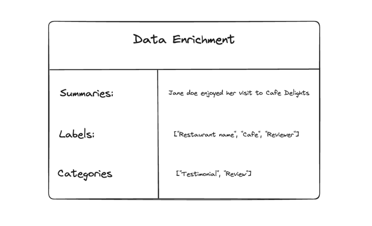
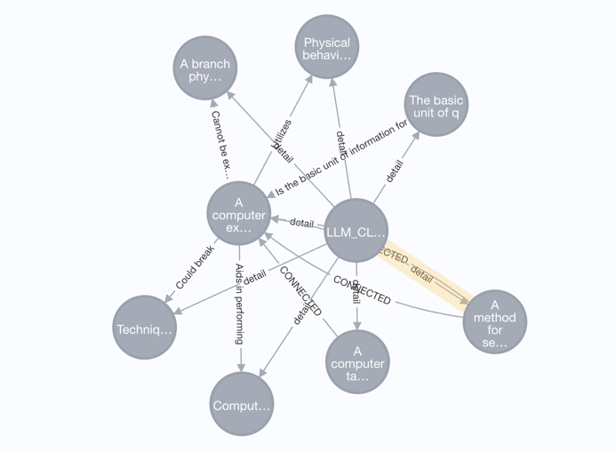
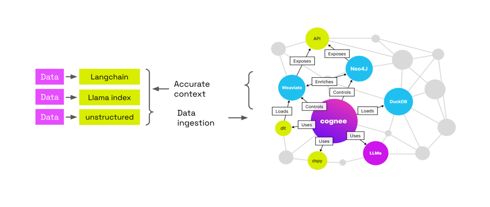

#  Conceptual Overview - cognee

## Introduction

!!! info "What is cognee?"
    cognee is a data processing framework that enables LLMs to produce deterministic and traceable outputs.

cognee assists developers in introducing greater predictability and management into their Retrieval-Augmented Generation (RAG) workflows through the use of graph architectures, vector stores, and auto-optimizing pipelines.

Displaying information as a graph is the clearest way to grasp the content of your documents. Crucially, graphs allow systematic navigation and extraction of data from documents based on their hierarchy.
## Core Concepts

### Concept 1: Data Pipelines
Most of the data we provide to a system can be categorized as unstructured, semi-structured, or structured. Rows from a database would belong to structured data, jsons to semi-structured data, and logs that we input into the system could be considered unstructured.
To organize and process this data, we need to ensure we have custom loaders for all data types, which can help us unify and organize it properly.
<figure markdown>

<figcaption>Data Pipeline Example</figcaption>
</figure>

In the example above, we have a pipeline in which data has been imported from various sources, normalized, and stored in a database. Relevant identifiers and relationships between the data are also created in this process.
To create an effective data pipeline for processing various types of data—structured, semi-structured, and unstructured—it’s crucial to understand each type's specific handling and processing needs. Let's expand on the concepts involved in setting up such a data pipeline.

Data Types and Their Handling
- Structured Data: This includes data that adheres to a fixed schema, such as rows in a relational database or data in CSV files. The processing of structured data typically involves SQL queries for extraction, transformations through simple functions or procedures, and loading into destination tables or databases.

- Semi-structured Data: JSON files, XML, or even some APIs' data fit this category. These data types don't have a rigid schema but have some organizational properties that can be exploited. Semi-structured data often requires parsers that can navigate its structure (like trees for XML or key-value pairs for JSON) to extract necessary information. Libraries such as json in Python or lxml for XML handling can be very useful here.

- Unstructured Data: This category includes text files, logs, or even images and videos. 

### Concept 2: Data Enrichment with LLMs
LLMs are adept at processing unstructured data. They can easily extract summaries, keywords, and other useful information from documents. We use function calling with Pydantic models to extract information from the unstructured data.
<figure markdown>

<figcaption>Data Enrichment Example</figcaption>
</figure>
We decompose the loaded content into graphs, allowing us to more precisely map out the relationships between entities and concepts.

### Concept 3: Graphs
Knowledge graphs simply map out knowledge, linking specific facts and their connections. 
When Large Language Models (LLMs) process text, they infer these links, leading to occasional inaccuracies due to their probabilistic nature. 

Clearly defined relationships enhance their accuracy.  

This structured approach can extend beyond concepts to document layouts, pages, or other organizational schemas.
<figure markdown>

<figcaption>Graph Structure</figcaption>
</figure>

### Concept 4: Vector and Graph Retrieval 
Cognee lets you use multiple vector and graph retrieval methods to find the most relevant information.
!!! info "Learn more?"
    Check out learning materials to see how you can use these methods in your projects.
### Concept 5: Auto-Optimizing Pipelines
Integrating knowledge graphs into Retrieval-Augmented Generation (RAG) pipelines leads to an intriguing outcome: the system's adeptness at contextual understanding allows it to be evaluated in a way Machine Learning (ML) engineers are accustomed to. 

This involves bombarding the RAG system with hundreds of synthetic questions, enabling the knowledge graph to evolve and refine its context autonomously over time. 

This method paves the way for developing self-improving memory engines that can adapt to new data and user feedback.

## Architecture Overview
A high-level diagram of cognee's architecture, illustrating the main components and their interactions.

<figure markdown>

<figcaption>Architecture</figcaption>
</figure>

Main components:

- **Data Pipelines**: Responsible for ingesting, processing, and transforming data from various sources.
- **LLMs**: Large Language Models that process unstructured data and generate text.
- **Graph Store**: Knowledge graphs that represent relationships between entities and concepts.
- **Vector Store**: Database that stores vector representations of data for efficient retrieval.
- **Search**: Retrieves relevant information from the knowledge graph and vector stores.

## How It Fits Into Your Projects

!!! info "How cognee fits into your projects"
    cognee is a self-contained library that simplifies the process of loading and structuring data in LLMs.

By integrating cognee into your data pipelines, you can leverage the power of LLMs, knowledge graphs, and vector retrieval to create accurate and explainable AI solutions.
cognee provides a self-contained library that simplifies the process of loading and structuring LLM context, enabling you to create accurate and explainable AI solutions.
