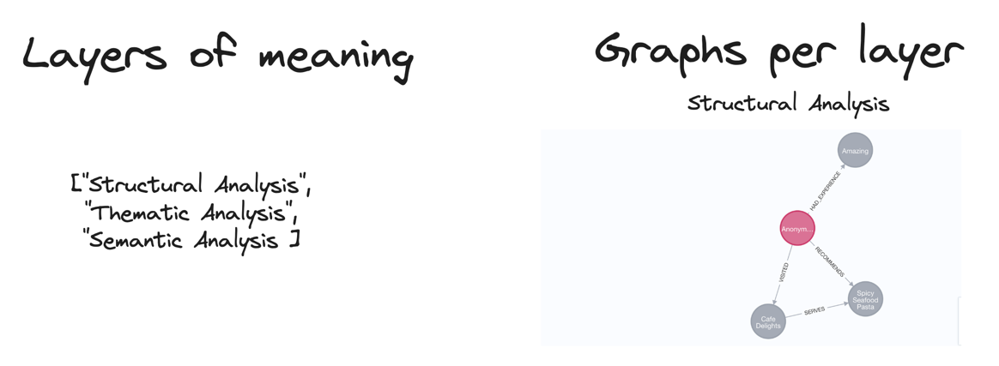

#  Conceptual Overview - cognee

## Introduction

!!! info "What is cognee?"
    cognee is a framework for data processing that enables LLMs to produce for deterministic and traceable outputs.

cognee focuses on creating tools that assist developers in introducing greater predictability and management into their Retrieval-Augmented Generation (RAG) workflows through the use of graph architectures, vector stores and auto-optimizing pipelines.

Displaying this information as a graph is the clearest method to grasp the content of your documents. Crucially, using a graph allows for the systematic navigation and extraction of data from documents based on your grasp of a document's organization, an idea often termed 'document hierarchies'.
## Core Concepts

### Concept 1: Data Pipelines
Most of the data we provide to a system can be understood as unstructured, semi-structured or structured. Rows from a database would belong to structured data, jsons to semi-structured data and logs could be unstructured. 
To organize and process this data, we need to make sure to have custom loaders for all data types and also to unify and organize the data well together. 
<figure markdown>

<figcaption>Data Pipeline Example</figcaption>
</figure>

In the example above, we have a data pipeline that imports the data from various sources, normalizes it, and stores it in a database. It also creates relevant identifiers and relationships between the data.
### Concept 2: Data Enrichment with LLMs
LLMs are adept at processing unstructured data. We can easily extract summaries, keywords, and other useful information from documents.
<figure markdown>

<figcaption>Data Enrichment Example</figcaption>
</figure>
We decompose content into graphs, allowing us to more precisely map out the relationships between entities and concepts. 

### Concept 3: Linguistic Analysis
LLMs are probabilistic models, meaning they can make mistakes. 
To mitigate this, we can use a combination of NLP and LLMs to determine how to analyze the data and score each part of the text. 

<figure markdown>

<figcaption>Linguistic analysis</figcaption>
</figure>
### Concept 4: Graphs
Knowledge graphs simply map out knowledge, linking specific facts and their connections. 
When Large Language Models (LLMs) process text, they infer these links, leading to occasional inaccuracies due to their probabilistic nature. 

Clearly defined relationships enhance their accuracy.  

This structured approach can extend beyond concepts to document layouts, pages, or other organizational schemas.
<figure markdown>

<figcaption>Graph Structure</figcaption>
</figure>
### Concept 5: Vector and Graph Retrieval 
Cognee lets you use multiple vector and graph retrieval methods to find the most relevant information.
!!! info "Learn more?"
    Check out learning materials to see how you can use these methods in your projects.
### Concept 6: Auto-Optimizing Pipelines
Integrating knowledge graphs into Retrieval-Augmented Generation (RAG) pipelines leads to an intriguing outcome: the system's adeptness at contextual understanding allows it to be evaluated in a way Machine Learning (ML) engineers are accustomed to. 

This involves bombarding the RAG system with hundreds of synthetic questions, enabling the knowledge graph to evolve and refine its context autonomously over time. 

This method paves the way for developing self-improving memory engines that can adapt to new data and user feedback.

## Architecture Overview
A high-level diagram of the cognee's architecture, illustrating the main components and their interactions. 

<figure markdown>

<figcaption>Architecture</figcaption>
</figure>

Main components:

- **Data Pipelines**: Responsible for ingesting, processing, and transforming data from various sources.
- **LLMs**: Large Language Models that process unstructured data and generate text.
- **Graphs**: Knowledge graphs that represent relationships between entities and concepts.
- **Vector Stores**: Databases that store vector representations of data for efficient retrieval.
- **dspy module**: Pipelines that automatically adjust based on feedback and data changes.
- **Search wrapper**: Retrieves relevant information from the knowledge graph and vector stores.

## How It Fits Into Your Projects

!!! info "How cognee fits into your projects"
    cognee is a self-contained library that simplifies the process of loading and structuring LLM context. It can be integrated into your data pipelines to enhance your AI applications.

By integrating cognee into your data pipelines, you can leverage the power of LLMs, knowledge graphs, and vector retrieval to enhance your AI applications. 

cognee provides a self-contained library that simplifies the process of loading and structuring LLM context, enabling you to create accurate and explainable AI solutions.

Check out some [case studies](case_studies.md) to see how cognee has been used in real-world applications.

