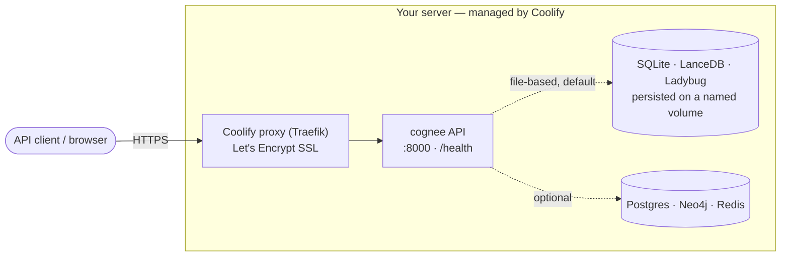
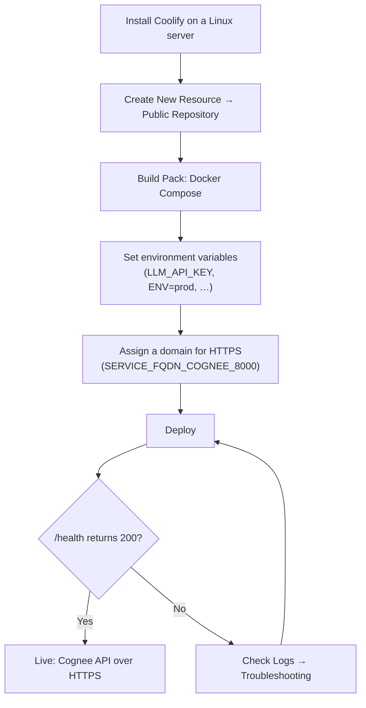

[Coolify](https://coolify.io/) is an open-source, self-hostable PaaS — a Heroku/Netlify
alternative that runs on **your own server** and deploys anything Docker can run. Because
Cognee ships a `docker-compose.yml`, Coolify can build, run, route, and TLS-terminate the
Cognee API for you, so you go from "it works on my laptop" to a public HTTPS endpoint without
writing any infrastructure code.

This guide deploys the **Cognee API server** (the `cognee` service). It uses a slim,
Coolify-friendly compose so the deployment is reliable on a modest server, and explains how to
add the optional services (databases, MCP server, UI) when you need them.

## Architecture



By default Cognee uses **file-based databases** (SQLite + LanceDB + Ladybug, Cognee's embedded
graph engine), so a working deployment needs **no external database** — just one API key.

## Prerequisites

- A **server** (VPS or bare metal) running a 64-bit Linux distro (Debian/Ubuntu recommended).
  Coolify itself idles at ~0.6–1 GB RAM, so plan for **4 GB+** even though the documented
  minimum is 2 GB.
- A running **Coolify** instance (v4). If you don't have one yet, follow **Step 1** below first.
- An **LLM API key**. Cognee defaults to OpenAI, so an OpenAI key works out of the box
  (`LLM_API_KEY`); any [supported provider](https://docs.cognee.ai/) can be configured later.
- *(Optional)* a **domain name** with a DNS `A` record pointing at your server, for a clean
  HTTPS URL. Coolify can also hand out a free `sslip.io` hostname.

## Deployment at a glance



## Step 1 — Install Coolify (skip if you already have it)

On a fresh server, run the official one-line installer as root (or with `sudo`):

```bash
curl -fsSL https://cdn.coollabs.io/coolify/install.sh | sudo bash
```

Open the dashboard at `http://<your-server-ip>:8000` and **register the first account** — the
first user to register owns the instance, so do this immediately. Ports used by Coolify:
**22** (SSH), **80** / **443** (proxy + SSL), and **8000 / 6001 / 6002** (dashboard, realtime,
terminal). Lock `8000` down to your own IP once you're set up.

<Note>
Coolify's proxy needs ports **80/443**. If another reverse proxy or PaaS already owns them on
the same host, free them first — two proxies can't bind the same ports.
</Note>

## Step 2 — Add Cognee as a Docker Compose resource

1. Open (or create) a **Project** and pick an environment (e.g. *production*).
2. Click **Create New Resource** and choose **Public Repository**.
3. Paste the repository URL (the upstream repo or your fork):
   ```
   https://github.com/topoteretes/cognee
   ```
4. Coolify defaults the build pack to **Nixpacks** — open that dropdown and select
   **Docker Compose**.
5. Set **Branch** to `main`, **Base Directory** to `/`, and **Docker Compose Location** to the
   compose file you want to deploy (see below).

### Use a slim, Coolify-friendly compose

Cognee's root `docker-compose.yml` is tuned for **local development** and has three rough edges
on Coolify. Knowing them saves hours:

| Repo `docker-compose.yml` | Why it bites on Coolify |
| --- | --- |
| Builds the image from source (`build:`) | The multi-stage `uv` build is heavy and can **OOM** a small server. Coolify's own docs recommend a **prebuilt image** on low-RAM hosts. |
| Declares a custom network (`cognee-network`) | Coolify warns that **custom networks cause intermittent 504s**; it auto-creates an isolated network per stack. |
| Gates optional services behind `profiles:` | Coolify **does not reliably honor compose profiles** ([issue #6395](https://github.com/coollabsio/coolify/issues/6395)) — it may start *every* service regardless. |

The fix is a small, production-oriented compose that uses the **official prebuilt image**
(`cognee/cognee:main`), declares no custom network, has a single service (no profiles), injects
config via Coolify environment variables, and persists data on a named volume. (It also drops the
repo compose's published `5678` debugger port.) Commit this file to your fork and point
**Docker Compose Location** at it, or paste it via Coolify's raw compose editor:

```yaml docker-compose.coolify.yml
services:
  cognee:
    image: cognee/cognee:main
    restart: always
    ports:
      - "8000:8000"
    environment:
      - LLM_API_KEY=${LLM_API_KEY}
      # Canonical env var (ENVIRONMENT is a deprecated alias). Use exactly "prod":
      # any other value enables FastAPI debug; "dev"/"local" also add Gunicorn auto-reload.
      - ENV=prod
      - DEBUG=false
      - LOG_LEVEL=INFO
      - CORS_ALLOWED_ORIGINS=${CORS_ALLOWED_ORIGINS:-*}
      # Keep the file-based databases on the persistent volume below.
      - DATA_ROOT_DIRECTORY=/app/.cognee/data
      - SYSTEM_ROOT_DIRECTORY=/app/.cognee/system
    volumes:
      - cognee_data:/app/.cognee
    healthcheck:
      test: ["CMD", "curl", "-f", "http://localhost:8000/health"]
      interval: 30s
      timeout: 10s
      retries: 3
      start_period: 40s

volumes:
  cognee_data:
```

<Tip>
The images `cognee/cognee` (API) and `cognee/cognee-mcp` (MCP server) are published to Docker Hub
on every release, so the prebuilt image skips the source build entirely.
</Tip>

### Reference: services in the full repo compose

If you do deploy the upstream `docker-compose.yml`, this is what it contains. Only services
**without** a `profiles:` key start under plain Docker Compose — the `cognee` API (`8000`) and
`redisinsight` (`5540`):

| Service        | Profile      | Default ports | Purpose                          |
| -------------- | ------------ | ------------- | -------------------------------- |
| `cognee`       | *(none)*     | 8000          | Core API server                  |
| `redisinsight` | *(none)*     | 5540          | Redis GUI                        |
| `cognee-mcp`   | `mcp`        | 8001          | MCP server for IDE integrations  |
| `frontend`     | `ui`         | 3000          | Experimental web UI              |
| `postgres`     | `postgres`   | 5432          | PostgreSQL + pgvector            |
| `neo4j`        | `neo4j`      | 7474 / 7687   | Neo4j graph database             |
| `redis`        | `redis`      | 6379          | Redis cache                      |

_Ports are host mappings; `cognee-mcp` listens on `8000` inside its container (mapped to host `8001`)._

<Warning>
These are Docker Compose **profiles** (activated with `--profile` / `COMPOSE_PROFILES` locally),
**not** commented-out lines to uncomment. Because Coolify doesn't reliably honor profiles, the
dependable way to choose services on Coolify is to put exactly what you want in the compose —
which is what the slim file above does.
</Warning>

## Step 3 — Configure environment variables

Open the resource's **Environment Variables** tab. Add variables one-by-one in **Normal View**,
or switch to **Developer View** to paste a block of `KEY=VALUE` lines at once. Cognee reads
variables straight from the container environment (they take precedence over any `.env` file),
so whatever you set here is applied on the next deploy.

The only variable you **must** set is the API key:

| Variable               | Required | Default             | Notes                                                        |
| ---------------------- | -------- | ------------------- | ------------------------------------------------------------ |
| `LLM_API_KEY`          | **Yes**  | —                   | OpenAI key by default; also used for embeddings if no separate key. |
| `LLM_MODEL`            | No       | `openai/gpt-5-mini` | Override the model.                                          |
| `LLM_PROVIDER`         | No       | `openai`            | `openai`, `anthropic`, `gemini`, `ollama`, …                |
| `CORS_ALLOWED_ORIGINS` | No       | `*`                 | Lock down to your domain(s) in production.                  |

<Warning>
The repo's `docker-compose.yml` **hard-codes `ENV=local`** inline on the `cognee` service. Inline
compose values **override** anything you set in the UI, so adding `ENV=…` (or the deprecated
`ENVIRONMENT=…`) there has **no effect** with that file. Use the slim compose above (it sets
`ENV=prod`) or edit the service's `environment:` block. Use **exactly `ENV=prod`**: the app enables
FastAPI debug mode for any other value (including `production`), and the entrypoint additionally
turns on Gunicorn auto-reload + verbose logs when `ENV` is `dev` or `local`.
</Warning>

## Step 4 — Persist data and choose your databases

**File-based (default, zero setup).** Cognee defaults to SQLite (relational), LanceDB (vector)
and Ladybug (graph) — Ladybug is Cognee's embedded graph engine; Kuzu is also supported. To
survive redeploys, keep them on a **named volume** — Coolify persists
named volumes automatically (it appends the resource UUID to the name). The slim compose does
this with `cognee_data` plus `DATA_ROOT_DIRECTORY` / `SYSTEM_ROOT_DIRECTORY`.

**External databases (optional).** To move onto Postgres or Neo4j, set the matching **provider**
variables — pointing only `DB_HOST` at a server is not enough. Run the database as a separate
Coolify resource, or add its service directly to your compose (declared normally, since Coolify
won't gate it behind a profile):

```env
# PostgreSQL (relational) — the bundled image is pgvector/pgvector:pg17
DB_PROVIDER=postgres
DB_HOST=postgres        # the compose service name, on the same Coolify network
DB_PORT=5432
DB_USERNAME=cognee
DB_PASSWORD=cognee
DB_NAME=cognee_db

# Vector store — built-in options are lancedb (default) and pgvector
VECTOR_DB_PROVIDER=pgvector

# Graph store — ladybug (default), kuzu, neo4j, …
GRAPH_DATABASE_PROVIDER=neo4j
GRAPH_DATABASE_URL=bolt://neo4j:7687
GRAPH_DATABASE_USERNAME=neo4j
GRAPH_DATABASE_PASSWORD=pleaseletmein
```

## Step 5 — Expose the API: domain, port & SSL

The `cognee` service listens on port **8000**. To publish it through Coolify's proxy with
automatic HTTPS, assign a domain to the service — either in its **Domains** field, or with
Coolify's magic variable in the compose:

```env
SERVICE_FQDN_COGNEE_8000=https://cognee.example.com
```

The identifier is the service name (`COGNEE`) with the container port appended (`_8000`).
Entering an `https://` domain makes Coolify request and auto-renew a **Let's Encrypt**
certificate via Traefik. (Magic variables in a Git-sourced compose require Coolify
**v4.0.0-beta.411+**; on older builds, assign the domain in the service's **Domains** field instead.)

<Note>
Let's Encrypt needs the domain's DNS `A` record pointing at the server and ports **80/443**
open, and it won't validate behind Cloudflare's proxied ("orange cloud") mode. Publishing a
`ports:` mapping alone exposes plain HTTP on the host and **bypasses** the proxy/SSL — use a
domain assignment for managed TLS.
</Note>

## Step 6 — Deploy and verify

Click **Deploy** and open the **Logs**. A healthy start runs the database migrations and then
Gunicorn binds the server:

```text
Debug mode: false
Environment: prod
HTTP port: 8000
Bind address: 0.0.0.0
Running database migrations...
Database migrations done.
Starting server...
```

With `ENV=prod`, Gunicorn logs at error level, so the startup banner is quiet — rely on the
health check below to confirm readiness.

Check the health endpoint — a ready instance returns HTTP `200`:

```bash
curl https://cognee.example.com/health
```

```json
{ "status": "ready", "health": "healthy", "version": "x.y.z" }
```

If a critical database or storage check fails, `/health` returns HTTP `503` with
`{"status": "not ready", "health": "unhealthy", …}` — there is no separate "starting" state, and a
degraded-but-usable instance still returns `200`. For a component-by-component breakdown call
`GET /health/detailed`, and the interactive API docs live at `/docs`.

<Note>
With default settings Cognee runs in **multi-tenant mode** (`ENABLE_BACKEND_ACCESS_CONTROL=True`),
so API endpoints require an authenticated user — but `/health` and `/docs` stay open, which is
all you need to confirm a successful deployment.
</Note>

## Production hardening

Before exposing Cognee publicly, review these defaults:

- **Authentication.** `ENABLE_BACKEND_ACCESS_CONTROL=True` (default) **requires auth** on the API
  — a `REQUIRE_AUTHENTICATION=False` is ignored while access control is on. Create a user, or for
  a single-user setup behind a token set `ENABLE_BACKEND_ACCESS_CONTROL=False`.
- **JWT secret.** Change `FASTAPI_USERS_JWT_SECRET` (default `super_secret`) to a long random
  string, identical across replicas.
- **CORS.** Replace the default `*` in `CORS_ALLOWED_ORIGINS` with your real front-end origin(s).
- **Secrets.** Never commit API keys — set them only as Coolify environment variables.

## Troubleshooting

| Symptom | Likely cause | Fix |
| --- | --- | --- |
| Build is slow / server runs out of memory | Building the image from source compiles many extras | Deploy the **prebuilt image** (`cognee/cognee:main`) via the slim compose (Step 2) |
| Intermittent `504 Gateway Timeout` | A custom `networks:` block in the compose | Remove custom networks; let Coolify manage the network (the slim compose has none) |
| Unwanted services (Postgres, Neo4j…) start anyway | Coolify doesn't honor compose `profiles:` ([#6395](https://github.com/coollabsio/coolify/issues/6395)) | Deploy a compose that contains only the services you want (the slim compose) |
| `ENV` / `ENVIRONMENT` changes have no effect | Repo compose hard-codes `ENV=local` inline | Edit the service `environment:`, or use the slim compose |
| Data disappears after a redeploy | File-based DBs weren't on a persistent volume | Use a **named** volume + `DATA_ROOT_DIRECTORY` / `SYSTEM_ROOT_DIRECTORY` (Step 2) |
| `/health` never turns ready | Can't reach a configured external DB, or migrations failed | Check **Logs**; verify `DB_*` / `GRAPH_*` values and that the DB is reachable |
| 401/403 on API calls (not `/health`) | Access control is on by default | Authenticate, or set `ENABLE_BACKEND_ACCESS_CONTROL=False` for single-user mode |
| Let's Encrypt certificate fails | DNS not pointing at server, ports 80/443 closed, or Cloudflare proxied | Fix DNS/ports; set Cloudflare DNS to "DNS only" |

## Cost estimate

Cognee runs comfortably on a small VPS; the main variable cost is LLM API usage.

| Tier | Specs | Approx. server cost |
| --- | --- | --- |
| Minimal (file-based DBs, light use) | 2 vCPU / 4 GB | ~$5–12 / month |
| Recommended (headroom for `cognify`) | 4 vCPU / 8 GB | ~$15–30 / month |
| External DBs / heavier graphs | 8 vCPU / 16 GB | ~$30–60 / month |

LLM token costs are separate and depend on your provider, model, and how much data you ingest.

## Next steps

- [Cognee SDK & API reference](https://docs.cognee.ai/)
- Build your graph: `add` → `cognify` → `search`
- Connect Cognee to your IDE by also deploying the MCP server (`cognee/cognee-mcp`)
