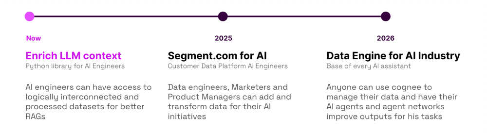

# cognee 

####  Deterministic LLMs Outputs for AI Engineers

_Open-source framework for loading and structuring LLM context to create accurate and explainable AI solutions using knowledge graphs and vector stores_

---

### Let's learn about cogneeHub!

cogneeHub is a free and open-sourced learning platform for those interested in creating deterministic LLM outputs.
We help people with using graphs, LLMs and adding vector retrieval to their ML stack. 

- **Get started** — [Get started with cognee quickly and try it out for yourself.](quickstart.md)
- **Conceptual Overview** — Learn about the [core concepts](conceptual_overview.md) of cognee and how it fits into your projects.
- **Data Engineering and LLMOps** — Learn about some [data engineering and llmops](data_engineering_llm_ops.md) core concepts that will help you build better AI apps.
- **RAGs** — We provide easy-to-follow [learning materials](rags.md) to help you learn about RAGs.
- **Research** — A list of resources to help you learn more about [cognee and LLM memory research](research.md)
- **Blog** — A blog where you can read about the [latest news and updates](blog/index.md) about cognee.
- **Support** — [Book time](https://www.cognee.ai/#bookTime) with our team.

[//]: # (- **Case Studies** — Read about [case studies]&#40;case_studies.md&#41; that show how cognee can be used in real-world applications.)

### Vision

### Architecture

### Why use cognee?

The question of using cognee is fundamentally a question of why to have deterministic outputs for your llm workflows.

1. **Cost-effective** — cognee extends the capabilities of your LLMs without the need for expensive data processing tools.

2. **Self-contained** — cognee runs as a library and is simple to use

3. **Interpretable** — Navigate graphs instead of embeddings to understand your data.

4. **User Guided** —  cognee lets you control your input and provide your own Pydantic data models 

## License

This project is licensed under the terms of the Apache License 2.0.
