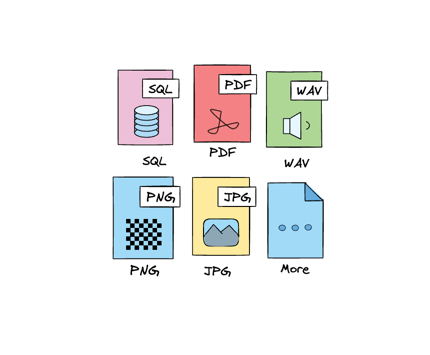
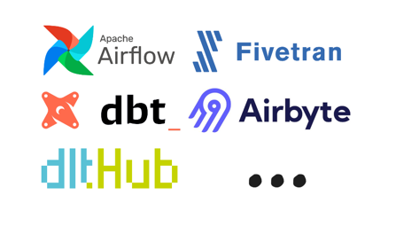
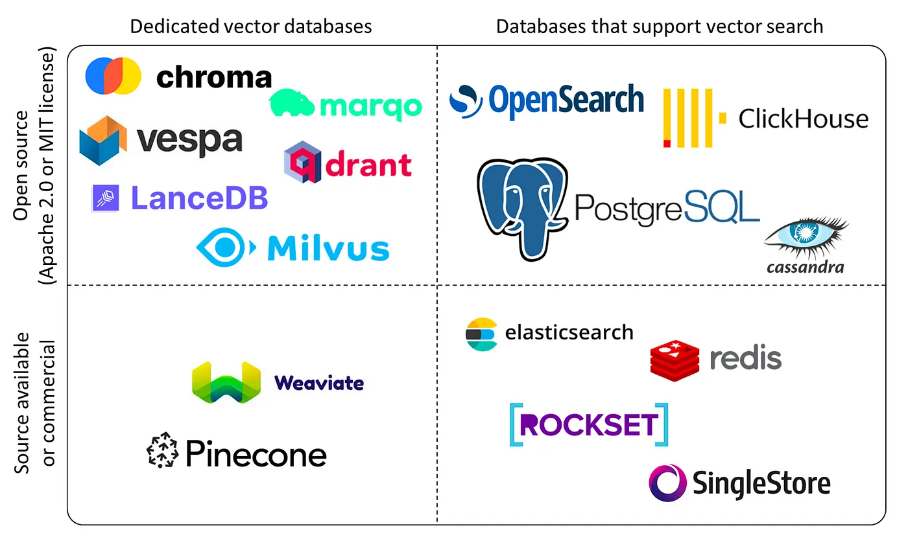
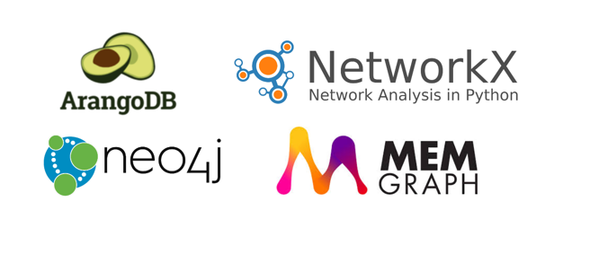

## RAG Stack
Core elements of a RAG stack are the building blocks that we can use to get to more personalized and deterministic outputs. 

!!! tip "This is a work in progress and any feedback is welcome"
## What is a RAG?

!!! note "What is RAG?"
    RAG stands for Retrieval Augmented Generation. It is a model that combines the power of large language models (LLMs) like GPT-4 with the efficiency of information retrieval systems. The goal of RAG is to generate text that is both fluent and factually accurate by retrieving relevant information from a knowledge base.

To try building a simple RAG and understand the limitations, check out this simple guide with examples: [RAGs: Retrieval-Augmented Generation Explained](rag/rag_explained.md)

## The Building Blocks of a RAG Stack

### 1. Data Sources

You can get your data from a variety of sources, including:

- APIs like Twitter, Reddit, and Google
- Web scraping tools like Scrapy and Beautiful Soup
- Documents like PDFs, Word, and Excel files
- Relational databases like DuckDB, PSQL and MySQL
- Data warehouses like Snowflake and Databricks
- Customer data platforms like Segment
<figure markdown>

<figcaption>Some data sources</figcaption>
</figure>
The goal here is to give the data structure and connect it so that it can be used in your deterministic LLM stack.

### 2. Data Loaders
<figure markdown>

<figcaption>Data Loaders</figcaption>
</figure>
Data loading into a data lake or warehouse involves using tools like Apache Airflow, dlt, dbt, and Databricks. The process includes data extraction, transformation, and loading for model usage, aiming for a clean, structured dataset ready for enrichment.
Check out how we do it with dlt: [Data Loading Tool (dlt)](dlt/dlt.md)
### 3. Vector Computation and Vector Stores
Data is transformed into vectors using OpenAI or custom models. Understanding where to run these models and integrating your computing infrastructure with tools like custom spark pipelines is essential. The aim is to achieve ready-to-use pipelines and models.
<figure markdown>

<figcaption>Vector Stores </figcaption>
</figure>
Image [Source](https://blog.det.life/why-you-shouldnt-invest-in-vector-databases-c0cd3f59d23c)
### 4. Graph Computation and Graph Stores
Creating a knowledge graph from your data allows for querying and information retrieval. It's essential to know how to construct, maintain, and use it for text generation. The aim is an accurate, current, and easily queried knowledge graph.
<figure markdown>

<figcaption>Graph Example</figcaption>
</figure>
### 5. Search 
The process involves querying and retrieving vectors from Vector DBs or hybrid DBs, and using search tools to rank these vectors. The aim is to index vectors and search for relevant ones as needed.
#### Vector Similarity Search
Identifies objects with vector representations closest to the query vector, finding the most similar items based on various dimensions of comparison.

#### Image Search
Utilizes images as the input for conducting a similarity search, analyzing the content of the image to find similar images based on visual features.

#### Keyword Search
Employs the BM25F algorithm for ranking results based on keyword matches. Relevance is calculated using term frequency, inverse document frequency, and field-length normalization.

#### Hybrid Search
Merges the BM25 algorithm with vector similarity search techniques to enhance the relevance and accuracy of search results. Leverages both textual and vector-based features for ranking.

#### Generative Search
Utilizes the outputs of search results as prompts for a Large Language Model (LLM). Can generate summaries, extrapolations, or new content based on the aggregated search results.

#### Reranking
Involves the application of a reranker module to adjust the initial ranking of search results. Optimizes result relevance based on additional criteria or more complex models.

#### Aggregation
Involves compiling and summarizing data from a set of search results. Provides insights or overviews based on the collective information found.

#### Filters
Apply constraints or conditions to the search process to narrow down the results. Filters can be based on specific attributes, metadata, or other criteria relevant to the search domain.

#### Graph Search
Involves traversing a graph data structure to find specific nodes or paths. It can be used to find relationships between different entities in a knowledge graph.