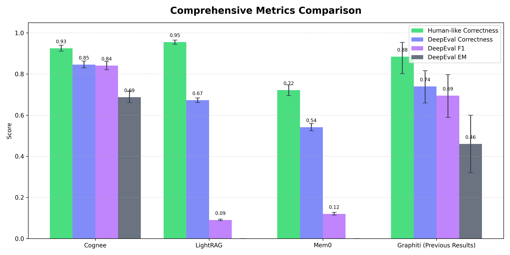

# QA Evaluation

Repeated runs of QA evaluation on 24-item HotpotQA subset, comparing Mem0, Graphiti, LightRAG, and Cognee (multiple retriever configs). Uses Modal for distributed benchmark execution.

## Dataset

- `hotpot_qa_24_corpus.json` and `hotpot_qa_24_qa_pairs.json`
- `hotpot_qa_24_instance_filter.json` for instance filtering

## Systems Evaluated

- **Mem0**: OpenAI-based memory QA system
- **Graphiti**: LangChain + Neo4j knowledge graph QA
- **LightRAG**: Falkor's GraphRAG-SDK
- **Cognee**: Multiple retriever configurations (GRAPH_COMPLETION, GRAPH_COMPLETION_COT, GRAPH_COMPLETION_CONTEXT_EXTENSION)

## Project Structure

- `src/` - Analysis scripts and QA implementations
- `src/modal_apps/` - Modal deployment configurations
- `src/qa/` - QA benchmark classes
- `src/helpers/` and `src/analysis/` - Utilities

**Notes:**
- Use `PyProject.toml` for dependencies
- Ensure Modal CLI is configured
- Modular QA benchmark classes enable parallel execution on other platforms beyond Modal

## Running Benchmarks (Modal)

Execute repeated runs via Modal apps:
- `modal run modal_apps/modal_qa_benchmark_<system>.py`

Where `<system>` is one of: `mem0`, `graphiti`, `lightrag`, `cognee`

Raw results stored in Modal volumes under `/qa-benchmarks/<benchmark>/{answers,evaluated}`

## Results Analysis

- `python run_cross_benchmark_analysis.py`
- Downloads Modal volumes, processes evaluated JSONs
- Generates per-benchmark CSVs and cross-benchmark summary
- Use `visualize_benchmarks.py` to create comparison charts

## Results

- **45 evaluation cycles** on 24 HotPotQA questions with multiple metrics (EM, F1, DeepEval Correctness, Human-like Correctness)
- **Significant variance** observed in metrics across small runs due to LLM-as-judge inconsistencies
- **Cognee showed consistent improvements** across all measured dimensions compared to Mem0, Lightrag, and Graphiti

### Visualization Results

The following charts visualize the benchmark results and performance comparisons:

#### Comprehensive Metrics Comparison

A comprehensive comparison of all evaluated systems across multiple metrics, showing Cognee's performance relative to Mem0, Graphiti, and LightRAG.

#### Optimized Cognee Configurations

Performance analysis of different Cognee retriever configurations (GRAPH_COMPLETION, GRAPH_COMPLETION_COT, GRAPH_COMPLETION_CONTEXT_EXTENSION), showing optimization results.

## Notes

- **Traditional QA metrics (EM/F1)** miss core value of AI memory systems - measure letter/word differences rather than information content
- **HotPotQA benchmark mismatch** - designed for multi-hop reasoning but operates in constrained contexts vs. real-world cross-context linking
- **DeepEval variance** - LLM-as-judge evaluation carries inconsistencies of underlying language model
