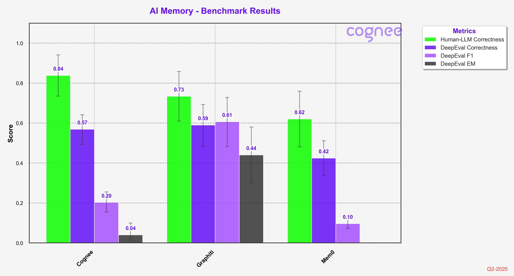

# Accuracy Analysis for AI Memory Systems

This repository contains a comparative analysis of three different question-answering systems: Mem0, Graphiti, and Falkor's GraphRAG-SDK. The analysis is performed using a subset of the HotpotQA dataset.

## Dataset

The analysis uses two key data files:
- `hotpot_50_corpus.json`: Contains 50 randomly selected instances from HotpotQA
- `hotpot_50_qa_pairs.json`: Contains corresponding question-answer pairs

### Generating the Dataset

You can generate these files using the Cognee framework:

```python
import json
from cognee.eval_framework.benchmark_adapters.hotpot_qa_adapter import HotpotQAAdapter

adapter = HotpotQAAdapter()
corpus_list, question_answer_pairs = adapter.load_corpus(limit=50)

with open('hotpot_50_corpus.json', 'w') as outfile:
    json.dump(corpus_list, outfile)
with open('hotpot_50_qa_pairs.json', 'w') as outfile:
    json.dump(question_answer_pairs, outfile)
```

## Systems Analyzed

### 1. Mem0

A memory-based QA system that uses OpenAI API for answering questions with context management.

#### Setup and Running
1. Clone the repository: `git clone https://github.com/mem0ai/mem0`
2. Create `.env` file with your `OPENAI_API_KEY`
3. Copy the dataset JSON files to the repo root
4. Run the analysis script: `python hotpot_qa_mem0.py`

Results are available in:
- `metrics_output_mem0.json`
- `metrics_output_mem0_direct_llm.json`
- `aggregate_metrics_mem0.json`
- `aggregate_metrics_mem0_direct_llm.json`

### 2. Graphiti

A knowledge graph-based QA system using LangChain and Neo4j.

#### Setup and Running
1. Clone the repository: `git clone https://github.com/getzep/graphiti.git`
2. Ensure Neo4j is running
3. Create `.env` file with:
   - `OPENAI_API_KEY`
   - `NEO4J_URI`
   - `NEO4J_USER`
   - `NEO4J_PASSWORD`
4. Copy the dataset JSON files to the repo root
5. Run the analysis script: `python hotpot_qa_graphiti.py`

Results are available in:
- `metrics_output_graphiti.json`
- `metrics_output_graphiti_direct_llm.json`
- `aggregate_metrics_graphiti.json`
- `aggregate_metrics_graphiti_direct_llm.json`


#### Human Evaluation

In order to ensure the highest possible accuracy of our results, we conducted a thorough human evaluation of the dataset. We had human evaluators compare responses against golden answers, and we manually reviewed each failed question to validate the results. 

Since we focused on validating false negatives rather than checking for false positives, the scores might be slightly higher than a comprehensive evaluation. However, we believe this difference is relatively small and doesn't significantly impact the comparative analysis.



#### Adding Dreamify

When we enhanced Cognee with Dreamify optimization, we saw significant improvements across all evaluation metrics, particularly in DeepEval F1 and EM scores.


#### Problems with the Approach

- LLM as a judge metrics are not reliable measure and can indicate the overall accuracy
- F1 scores measure character matching and are too granular for use in semantic memory evaluation
- Human as a judge is labor intensive and does not scale
- Hotpot is not the hardest metric out there


## Results

The results for each system are stored in separate JSON files, containing both detailed metrics and aggregate performance measures. These can be found in the respective metrics output files for each system.